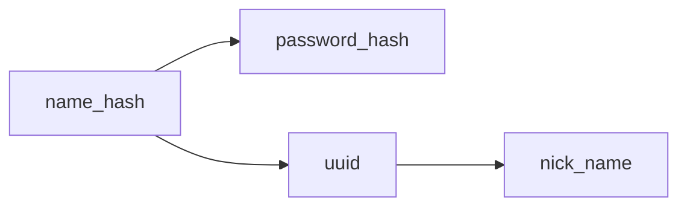
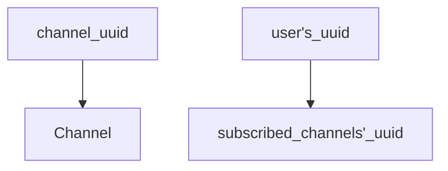
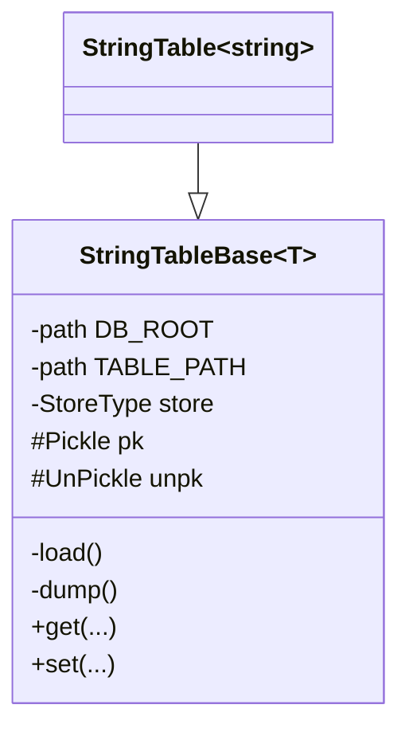
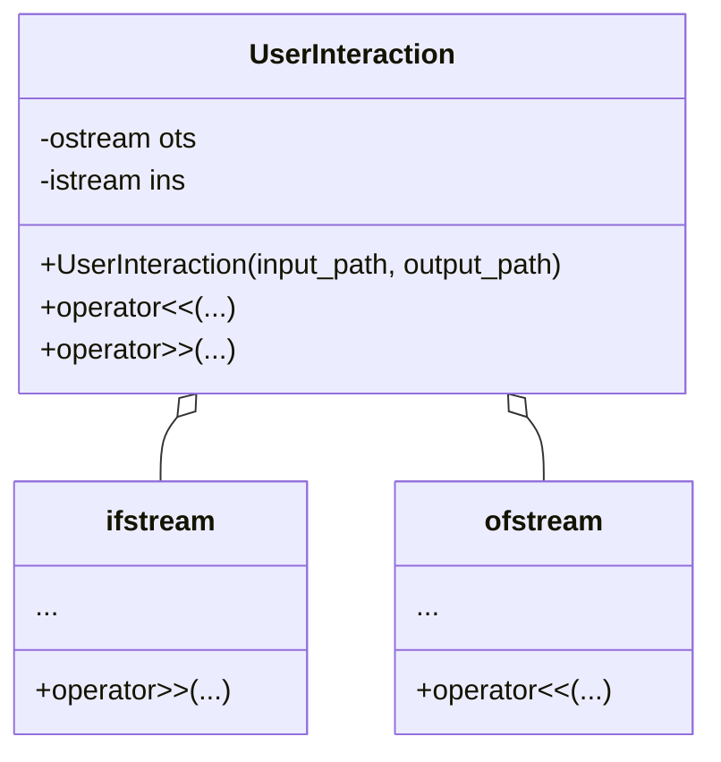
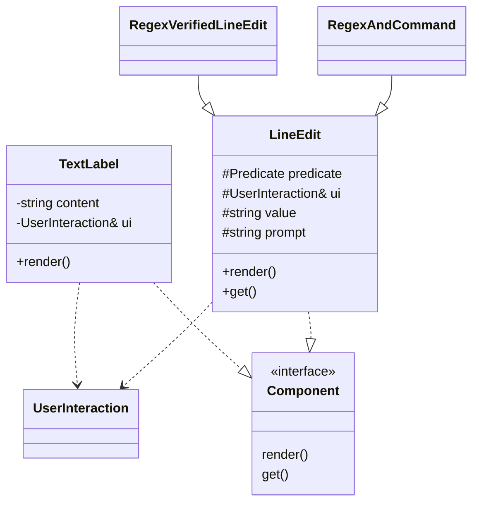
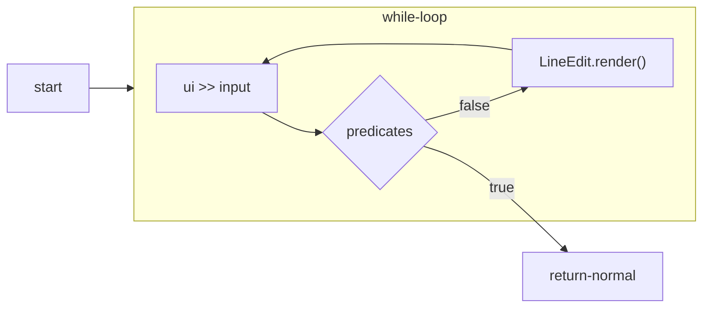
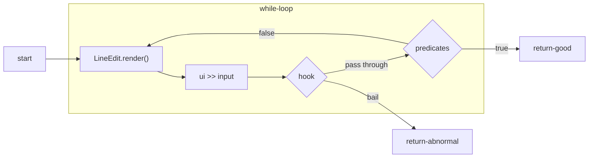

## 四、总结与体会

我不具备设计complex system的能力，在设计这个软件的过程中我很纠结，不知道该怎么设计，搞不清楚各个子系统之间要如何interact，要遵守什么约定，使用什么样的interface，我都搞不清。从这门课的设计要求来看，功能很多，每个功能都需要大量复杂的infrastructure来支撑，that is where the things get out of my hands，设计这些infrastructure的过程，我尤其觉得力不从心。功能太多了，做不过来。未来要更加努力的学习。我花在前期设计上的时间太少了，功能设计一边做一边改。我很羡慕这个舍友刘某，他掌握了Qt GUI开发技术，可以很快的做出正常的GUI而不是用text stream糊弄。

## 一、设计任务分析

本小节要对设计任务进行分析。本软件的开发是一是为了应付这门课程的及格和学分，二是为了锻炼自己的debug能力，最后是提高自己使用C++语言和生态的熟练度。

从分发的课程设计题面来看，功能展示要求有：

- 开通服务情况、群成员信息等信息可以从文件系统加载。
- 一个服务登陆后其他服务都进入开通状态
- 服务之间可以根据添加好友
- 展示群的特色功能
- 群的类型的动态变换

## 二、设计方案

在本软件的输入输出方面，它和用户是通过text stream交互；用简单的行文本文件来保存数据到文件系统，并向其他子系统提供key-value pair访问的抽象。

在业务逻辑部分，我把系统分成六个部分，下面逐一介绍：

### Meta

该子系统负责处理账号的metadata，显然，这些metadata一旦生成就不能修改，对用户来说是只读的，并且几乎没有必要向用户直接展示其值，且一定要有一个账号与之关联。这些metadata的生成很廉价，可以随意丢弃。该子系统为设计要求中记录用户的，and I quote，“号码ID”和“T龄”，end quote，提供支撑。

目前包括两个信息：

- uuid，这是用户在本系统中的唯一标识符，这种标识符的值空间中元素的数量比已知宇宙中的原子数目还要多，不论其他服务开通如何，这里提供ground truth。
- creation time，这是账号的创建时间。

向其他子系统提供的功能有：

- Get Account Meta，提供一个合理的值，包括目前系统使用的metadata的各字段。

为了支撑系统未来的功能扩展，该系统可以做的改进有：

- TODO

#### 实现细节

这里没有什么细节，就是一个隐藏了诸构造函数的类，用静态方法生成一个metadata object，相关代码如下：

```c++
struct AccountMeta {
  uuid id{};
  TimeStamp creation_time{};

  static AccountMeta
  GetAccountMeta(const string& nickname);

 private:
  AccountMeta() = default;
};
```

#### 讨论

没有什么可讨论的，用随机数代替uuid。

### Info

该子系统负责处理User Generated Content（UGC），也就是由用户输入进系统的内容。不用担心，虽然我们会log用户输入的内容，但是我们不使用受CVE-2021-44228以及后继CVE-2021-45046影响的诸程序。这种UGC是用户可以修改的，每个“微×平台”可以自己添加额外的内容，

目前提供的基本信息有：

- display name，用户展示给其他用户的名字，可以叫做昵称。
- personal tagline，个性签名，用户展示给其他用户的内容，可以用作自我介绍。

向其他子系统提供的功能有：

- Query Info，根据账号的uuid，查询关联的UGC
- Update Info，根据账号的uuid，更新关联的UGC

为了支撑系统未来的功能扩展，该系统可以做的改进有：

- TODO

#### 实现细节

这里没有什么细节，就是一个数据表和一个页面用来更新账号的资料的。

#### 讨论

此处最麻烦的就是在text stream里面处理unicode字符，我现在还不知道该怎么弄，至少要做两次编码的转换，一个是从用户的terminal到程序的内存，二个是从程序的内存再转回到terminal。其他问题还包括微软C++的regex实现中`\w`并不能匹配一个中文字，要匹配一个中文字应该用`[\u4e00-\u9fa5]`才行。

### Account

该子系统的负责处理，账号的创建和登陆，会使用到Meta子系统和Store子系统。

#### 实现细节

该子系统主要包括了一个`AccountService`和诸面向end user的UI页面。

`AccountService`使用三个`StringTable`实例，来完成如下key-value映射，聊以支撑用户注册和登陆，以及用户名模糊搜索的功能：



用户注册时，会输入全网唯一的display name，以及自己的密码，display name和密码加盐散列之后，存储到数据表中。同时为该账号生成一个uuid，并记录uuid到其display name的映射。

用户登陆时，将首先给出要登陆账号的display name，然后给出密码，`AccountService`加盐散列后在数据表中查询，成功匹配就告成功，`AccountService`便返回跟此账号关联的uuid。

一次典型的用户登陆实录如下，其中不带prompt的行是系统显示的，带prompt的是用户输入的：

```
===Welcome! Please Login!===
you may use following commands: 
":quit" 
Your nick name:  (should match ^\w{3,30}$)
user> [brave_turing]
you may use following commands: 
":quit" 
Your password:  (should match ^\d{3,20}$)
user> [5416]
===密码错误===
===Welcome! Please Login!===
you may use following commands: 
":quit" 
Your nick name:  (should match ^\w{3,30}$)
user> [brave_turing]
you may use following commands: 
":quit" 
Your password:  (should match ^\d{3,20}$)
user> [4544]
===密码错误===
===Welcome! Please Login!===
you may use following commands: 
":quit" 
Your nick name:  (should match ^\w{3,30}$)
user> [brave_turing]
you may use following commands: 
":quit" 
Your password:  (should match ^\d{3,20}$)
user> [45448079478364]
===密码错误===
===Welcome! Please Login!===
you may use following commands: 
":quit" 
Your nick name:  (should match ^\w{3,30}$)
user> [brave_turing]
you may use following commands: 
":quit" 
Your password:  (should match ^\d{3,20}$)
user> [454480794783645416]
===登陆成功===
```

我还实现了对其他用户的用户名的模糊搜索，这是方便用户查找其他账号发起聊天时使用的。这是使用正则表达式匹配实现的简单模糊搜索，典型的交互实录如下，正则表达式对于我们SE和CS专业的人才应该是非常熟练的：

```
===用正则表达式搜索用户名，not some performant implementation===
you may use following commands: 
":quit" 
regex:  (should match ^.{3,30}$)
user> [(friendly)|(libq)|(b)]
===单选一个===
===[1] brave_turing===
===[2] wonderful_aryabhata===
===[3] upbeat_northcutt===
===[4] boring_edison===
===[5] quirky_beaver===
===[6] flamboyant_galois===
===[7] festive_dubinsky===
===[8] infallible_roentgen===
===[9] boring_mirzakhani===
===[10] zealous_bouman===
===[11] friendly_chaplygin===
===[12] boring_antonelli===
===[13] hopeful_babbage===
===[14] friendly_goodall===
===[15] hardcore_black===
===[16] libq===
===end of list===
you may use following commands: 
":quit" 
your choice:  (should match ^\d{1,4}$)
user> [8]
===好，与infallible_roentgen开始聊天===
```

#### 讨论

我在使用微软的C++标准库的`string`的hash实现时，观察到了相当多的碰撞。对3000个随机生成的用户名逐一进行散列，它们各不相同，但是观察到只有2500余个不同的hash值，我后来尝试使用了其他的简单hash算法以及最简单的多项式hash，同样观察到只有2800余个不同的hash值，我目前尚不知道是怎么回事。另外，我用mt19937伪随机数生成器生成的所谓uuid可以做得到生成3000次就得到3000个各异的随机数。

### Chat

该子系统负责处理用户之间的消息，to do that 该子系统为其他子系统提供Channel抽象。

Channel用一个uuid来唯一标识，并负责储存ChannelHistory，向外界提供：

- push，添加`ChannelHistory`中的信息。
- pull，取得`ChannelHistory`中的消息。

该子系统向外界提供如下服务：

- `create channel`，创建一个新的Channel。
- connect to，disconnect from，处理账号和Channel的关系，如果用户和Channel是connected，用户就可以对这个Channel push or pull。

为了支撑系统未来的功能扩展，该系统可以做的改进有：

- TODO

#### 实现细节

该系统目前只记录两件事，依托于下文叙述的`StringTableBase`模板：



该系统是如何完成用户聊天的功能的呢，目前的设计中有如下两种情形。

例如，两个账号一对一的聊天：

0. 要求用户登陆到甲账号，然后ChatService生成一个Channel，并把Channel加入到甲账号的收听列表中。
1. 用户再次输入乙账号的uuid，ChatService把上一步中的Channel加入到乙用户的收听列表中。
2. 接下来用户可以用甲账号向该Channel push消息。
3. 乙账号登陆后，检视自己账号的收听列表，逐一从里面的Channel中pull消息。

再例如，一群账号的多人聊天：

0. 按照一定的domain logic，子系统要求ChatService生成一个Channel。
1. 多个账号请求收听上面的Channel的uuid，ChatService便把把上一步中的Channel加入到该账号的收听列表中。
2. 某账号可以检视自己的收听列表，逐一从里面的Channel中pull消息。
3. 某账号可以输入Channel的uuid，并向其push消息。

诚然，这仅仅是最基础的功能的实现，在其外围，势必要包装上诸domain logic才能完成面向end user的功能。该子系统只负责忠实传达用户之间的消息，其他内容一概不理会，应由其他子系统实现。

#### 讨论

这里没有什么可讨论的，我draw inspiration from message queue, as in the distributed system context。

### Store

该子系统负责把软件的状态保存到文件系统中，并在软件需要时从文件系统恢复。该系统向外界提供key-value pair container的抽象，具体提供如下功能：

- get，取得跟某个key关联的的数据。
- set，设置某个key关联的数据。

为了支撑系统未来的功能扩展，该系统可以做的改进有：

- TODO

#### 实现细节

file format采用非常简单的按行分隔模式即，`<key> <value>\n`为一条记录，此处需要serialization和deserialization。只要使用者指定自己想要存储的数据类型的serialization和deserialization方法，就可以使用该子系统提供的功能。简单的数据类型如数字`string`等就按人类可读文本进行编码，稍复杂的数据类型使用JSON格式储存。

为此我设计了`StringTableBase`类，用C++的模板特性实现，设计一览如下。



其中该模板`string`类型的`specialization`所使用的的`Pickle`和`UnPickle`是简单的identity function。

相关代码如下：

```c++
template<typename T=string>
class StringTableBase {
  using Pickle = std::function<string(const T&)>;
  using UnPickle = std::function<T(const string&)>;
  const static inline auto& T_identity = [](const T& s) { return s; };
  using StoreType = std::unordered_map<uuid, T>;
 protected:
  Pickle pk;
  UnPickle unpk;
  StoreType store;
  
  ...
}

StringTableBase(const string& DB_ROOT,
                const string& TABLE_NAME,
                StringTableBase::Pickle pk = T_identity,
                StringTableBase::UnPickle unpk = T_identity) :
DB_ROOT(DB_ROOT), pk(pk), unpk(unpk) {

  ...
}
```

在其他子系统中specialized的类实例中也有使用JSON格式来完成serialization和deserialization的，代码示意如图，这是模板specialization`StringTableBase<Subscription>`中使用的serialization和deserialization方法：

```c++
Subscription
Subscription::unpickle(const string& txt) {

  namespace j = json;
  auto obj = j::JSON::Load(txt);
  if (obj["sanity"].IsNull()) {
	return {};
  }

  Subscription ch;
  ch.user_id = obj["channel_uuid"].ToInt();
  for (const auto& id: obj["channels"].ArrayRange()) {
	ch.channels.insert(id.ToInt());
  }
  return ch;
}

string
Subscription::pickle(const Subscription& ch) {

  namespace j = json;
  auto obj = j::Object();

  auto& arr = obj["channels"];
  for (const auto& id: ch.channels) {
	arr.append(j::JSON(id));
  }
  obj["channel_uuid"] = ch.user_id;
  obj["sanity"] = true;

  auto json_txt = obj.dump(0, "");
  std::replace(json_txt.begin(), json_txt.end(), '\n', ' ');
  return json_txt;
}
```

#### 讨论

自己手工搭建这一所谓的key-value pair data storage系统并不方便，可能还不如使用成熟的ORM和正儿八经的数据库实现。

### User Interface

该子系统负责处理用户的输入，并把向其他子系统提供渲染控件的功能，它使用blocking的text stream来与用户交互。提供如下功能：

- render，把控件展示给用户
- get，返回用户交互的状态码和调用者需要的数据。

为了支撑系统未来的功能扩展，该系统可以做的改进有：

- TODO

#### 实现细节

首先为了软件调试的方便，我设计了`UserInteraction`类，设计一览如下。



它能从文件中导入用户的输入，并把各控件渲染的结果记录到文件中，省去我每次反复输入的烦恼。

例如，要模拟用户的注册，我使用的源文件和运行时效果类似：

```
// user input source
eloquent_mcnulty
7521856058124065
wonderful_aryabhata
77208342356222461
amazing_mclean
5306883560681846
strange_leavitt
469567732119057

// rendered screen
===开始注册新用户了===
Your nick name: (should match ^\w{3,30}$)
user> [eloquent_mcnulty]
Your password: (should match ^\d{3,20}$)
user> [7521856058124065]
===注册终了===
===开始注册新用户了===
Your nick name: (should match ^\w{3,30}$)
user> [wonderful_aryabhata]
Your password: (should match ^\d{3,20}$)
user> [77208342356222461]
===注册终了===
===开始注册新用户了===
Your nick name: (should match ^\w{3,30}$)
user> [amazing_mclean]
Your password: (should match ^\d{3,20}$)
user> [5306883560681846]
===注册终了===
===开始注册新用户了===
Your nick name: (should match ^\w{3,30}$)
user> [strange_leavitt]
Your password: (should match ^\d{3,20}$)
user> [469567732119057]
===注册终了===
```

可以看到其中带有prompt的行是模拟用户输入的内容，其余的则是控件渲染的结果。

根据系统的需要，我实现了单选控件`SingleSelect`和几种行输入控件`LineEdit`、`RegexVerifiedLineEdit`、`RegexAndCommand`，设计一览如下。



`LineEdit`会读入text stream中一行用户的输入，将其值传给`predicate`判断是否接受，不接受则要求用户重新输入。`RegexVerifiedLineEdit`和`RegexAndCommand`只是一个`LineEdit`的wrapper，它们用函数工厂生产各自的`predictate`来完成用正则表达式校验用户输入，或是解析用户的命令之功能。`RegexAndCommand`在使用正则表达式校验的基础上还会接受调用者指定的一些命令，然后返回调用者相应的状态码。这种控件的存在主要是让用户交互界面的设计者能够提供让用户随时退出中断当前操作的功能。典型的使用方法如下：

```c++
RegexAndCommand for_pwd("Your password: ", R"(^\d{3,20}$)", {":quit"});
const auto&[status, pwd] = for_pwd.render().get();
if (status.is_good()) {
    // continue as password matched
} else if (status.is_user_cancelled()) {
    // continue as user quit entering password
}
```

`RegexVerifiedLineEdit`使用的函数工厂示意如下：

```c++
auto
get_regex_validator(const std::string& rgx) {

  return [&rgx](const string& txt) {
	const auto& result = std::regex_search(txt, std::regex(rgx));
	return result;
  };
}
```

`RegexAndCommand`使用的函数工厂示意如下：

```c++
//ui_components.h
struct CmdValidatorBuilder : LineEdit::Predicate {
  CmdValidatorBuilder(LineEdit::Predicate base,
					  const std::initializer_list<string>& acceptable_cmd);

  std::string received_cmd;
  std::set<string> acceptable_cmd;
  LineEdit::Predicate base;

  auto
  get_validator();
};

class RegexAndCommand : private LineEdit {
 public:
  RegexAndCommand(
	  const string& prompt,
	  const std::string& regex_expr,
	  std::initializer_list<string> commands);

  CmdValidatorBuilder builder;
  
  void
  render() override;

  StatusAnd<string>
  get();
}

//ui_components.cpp
CmdValidatorBuilder::CmdValidatorBuilder(
	LineEdit::Predicate base,
	const std::initializer_list<string>& acceptable_cmd) :
	base(std::move(base)), acceptable_cmd(acceptable_cmd) {}

auto
CmdValidatorBuilder::get_validator() {

  return [&](const string& txt) {
	if (acceptable_cmd.contains(txt)) {
	  received_cmd = txt;
	  return true;
	} else {
	  return base(txt);
	}
  };
}

RegexAndCommand::RegexAndCommand(
	const string& prompt, const std::string& regex_expr,
	std::initializer_list<string> commands) :
	builder(get_regex_validator(regex_expr), commands),
	LineEdit(prompt + std::format(" (should match {})\n", regex_expr)) {

  predicate = builder.get_validator();
}
```

#### 讨论

用这种方法处理escape tokens并不是什么理想的做法。我考虑过如下方案：把响应predicate结果的逻辑拔高一层，并在控件从`UserInteraction`提取用户输入的内容之前hook。目前相应predicate结果的逻辑写在控件基类`LineEdit`中，其逻辑是重试直到用户输入被predicate接受。

目前的做法：



proposed做法：



### Miscellaneous

该部分介绍我设计的一些make life easier的功能。

#### StatusAnd模板

我设计了`StatusAnd`模板，封装了对状态码的描述和生成的过程，避免了magic numbers外泄到整个系统，相关代码实例如下，状态码的convention basically follows http status code：

```c++
using Status = short;

template<typename T>
struct StatusAnd {
    Status status;
    T payload;

    [[nodiscard]] inline bool
        user_cancelled() const {

        return status == 499;
    }

    [[nodiscard]] inline bool
        is_good() const {

        return status == 200;
    }
    
    [[nodiscard]] inline bool
        is_bad() const {

        return status == 400;
    }

    static inline StatusAnd<T>
        Cancelled() {

        return StatusAnd<T>{499, {}};
    }

    static inline StatusAnd<T>
        Good(const T& p) {

        return StatusAnd<T>{200, p};
    }

    static inline StatusAnd<T>
        Bad() {

        return StatusAnd<T>{400, {}};
    }
};
```

##### 实现细节

我希望尽可能避免复制payload object，也许使用`shared_ptr`是比较好的办法。

##### 讨论

状态码的使用，我觉得很不方便，因为每次都要写诸如此类的explicit branches，这很麻烦。

```c++
const auto& from_update = update.render().get();
if (from_update.user_cancelled()) {
    // ...
} else if (from_update.is_good()) {
    // ...
} else {
    // ...
}
```

期望的效果是如下

```c++
from_update.render().get()
    .on_good(
    [&]() {
        // ...
    })
    .on_cancelled(
    [&]() {
        // ...
    })
    .on(
    "shit hits the fan",
    [&]() {
        // ...
    });
```

#### UI控件

##### 讨论

另外本系统中大量使用了UI控件的概念，UI控件是用来跟用户交互的对象，这些控件能往上述text stream中拉取和输出字符，并承担一定的validation工作。不过由于才疏学浅，我没能实现异步地实现这些I/O的功能。这些控件组合之后可以实现一个完成较复杂功能的页面。如果这里能异步，就可以做成daemon-client架构了。

#### Escaped Commands

##### 讨论

本意是想借此种命令完成页面之间的跳转，但是才疏学浅，在UI子系统架构设计中没有很好的支持这种功能，勉强实现了取消当前页面的操作。

## 三、详细设计

略，参见上段。
