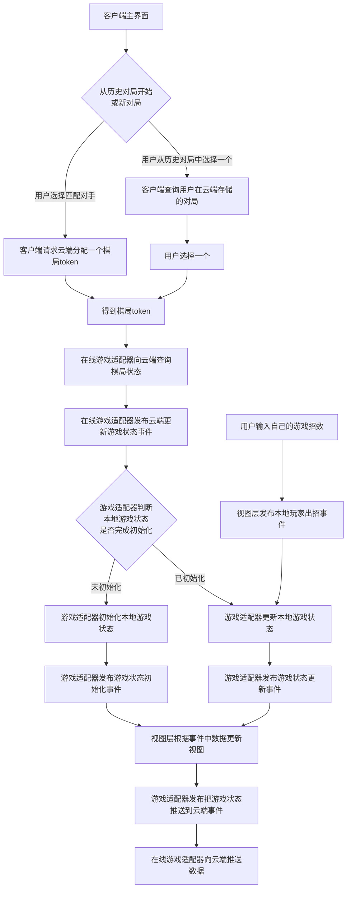
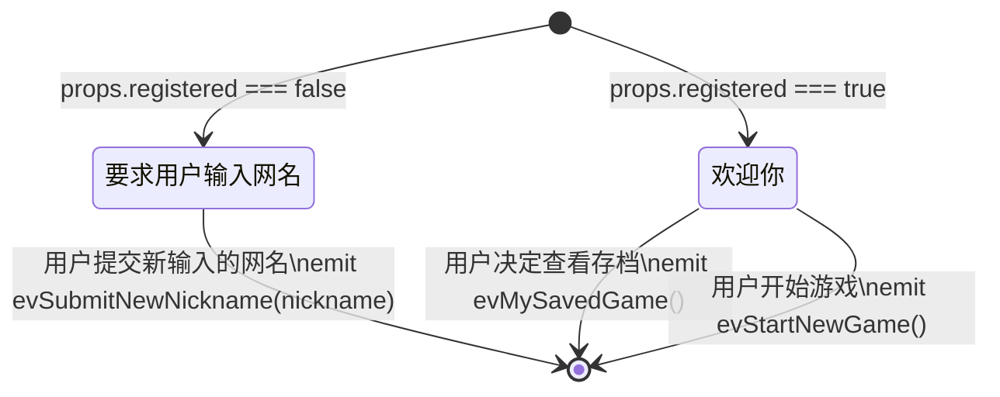
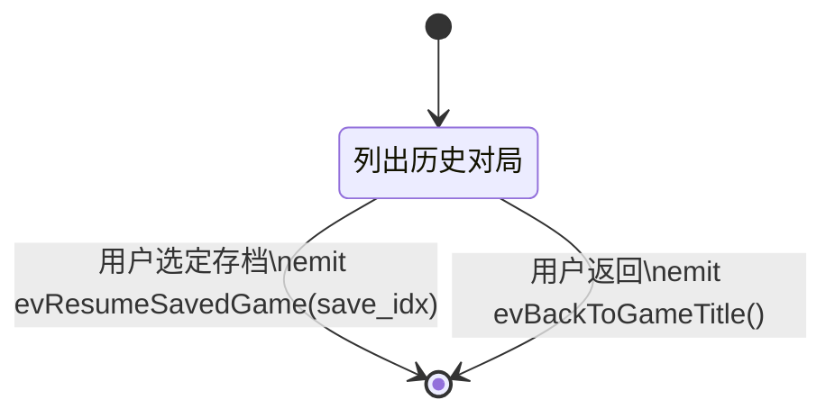
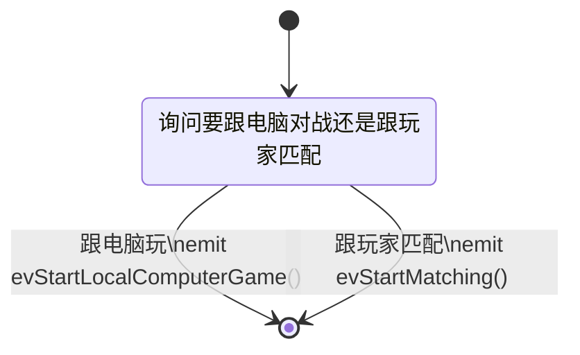
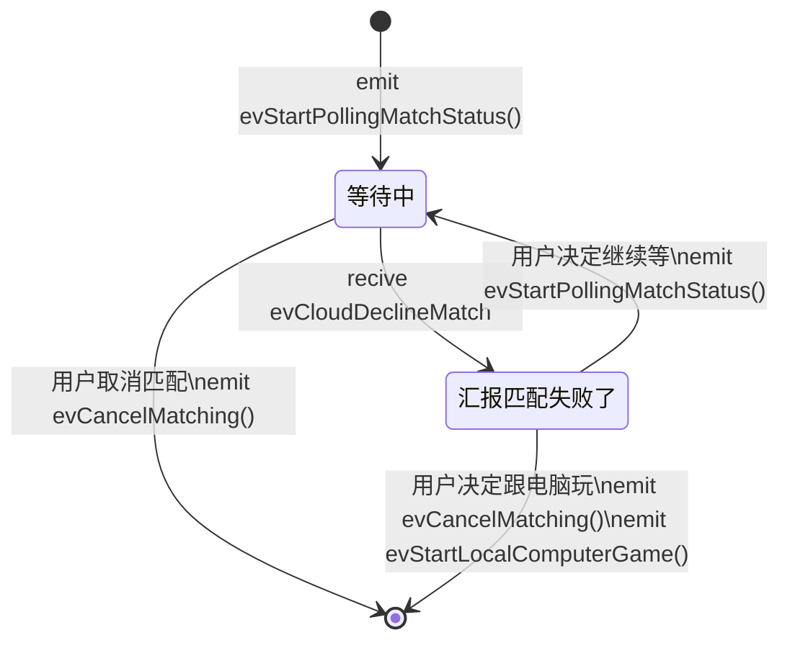
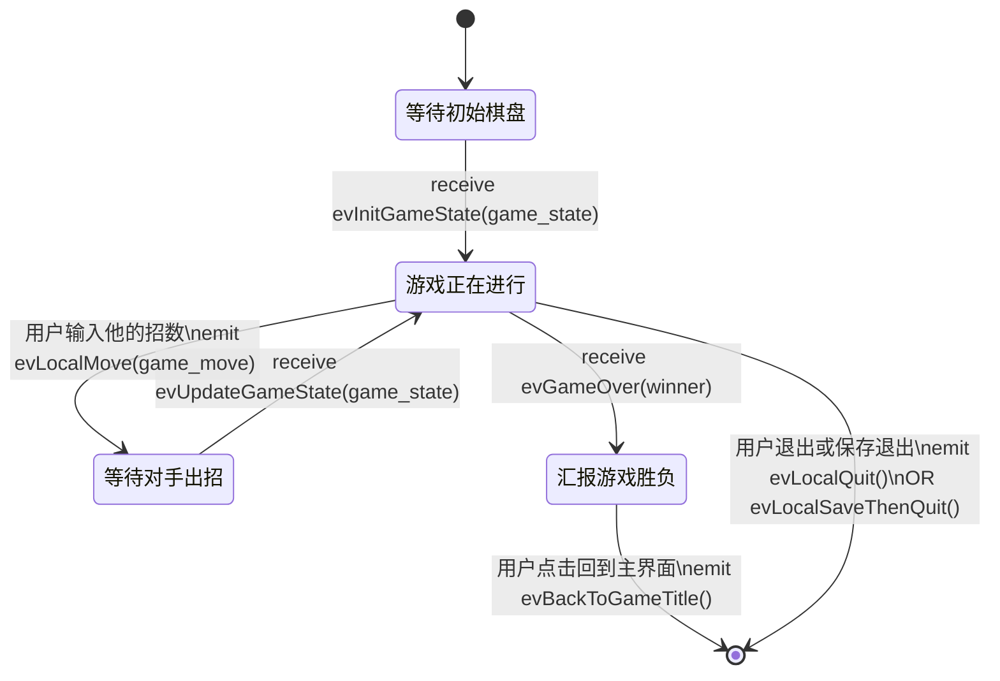
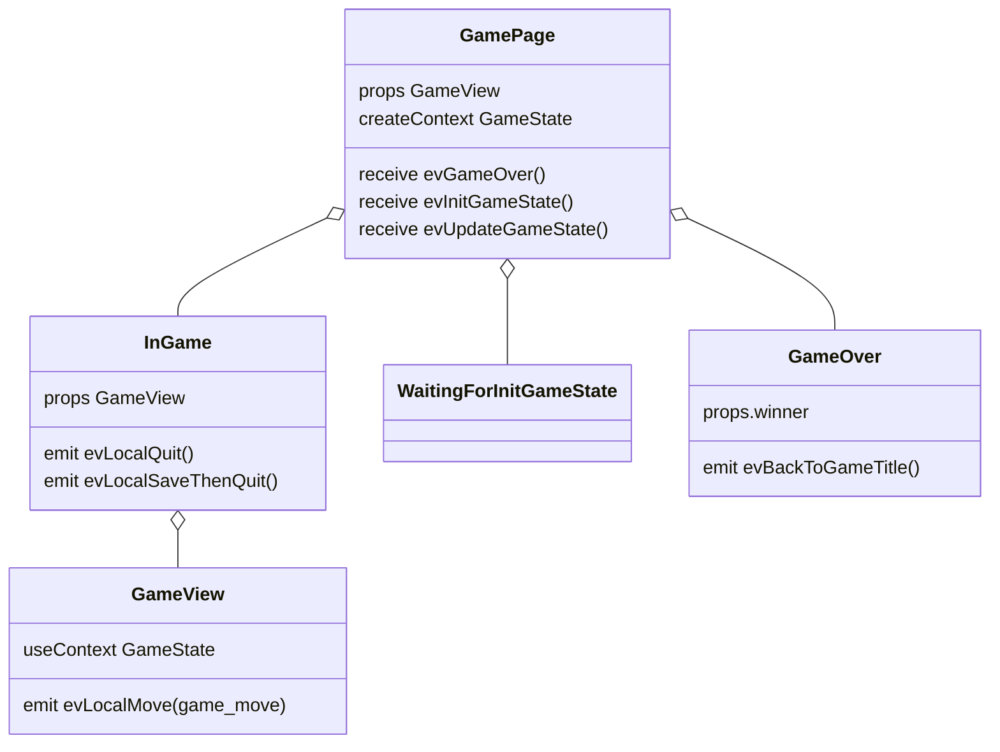
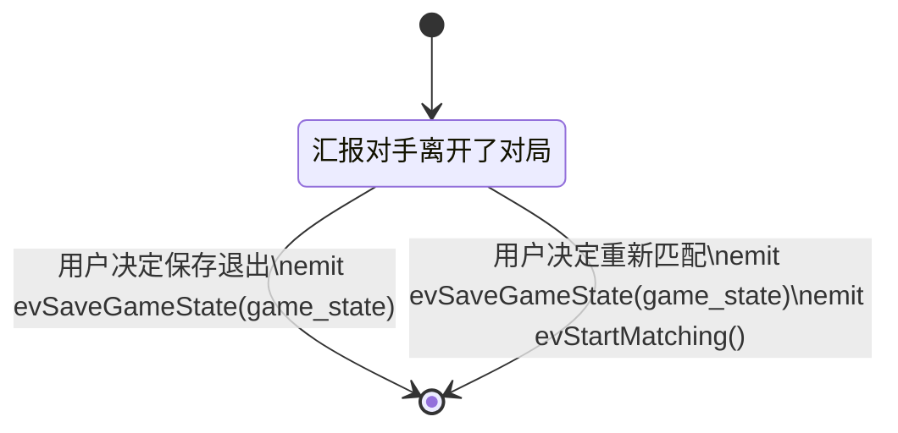
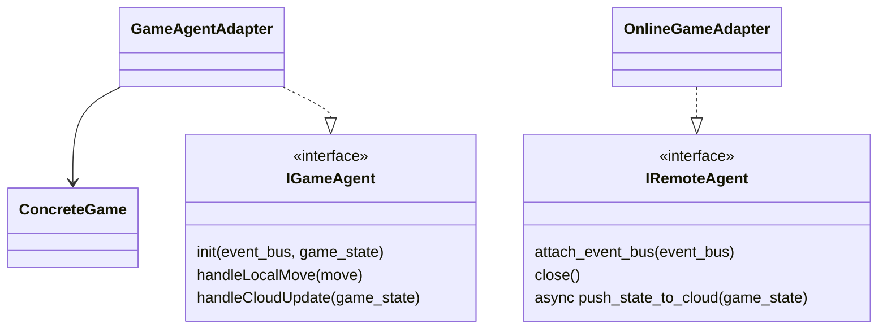

# 待办任务

- [x] [PR#1](https://github.com/li6in9muyou/kingz-tk7/pull/1) 缺陷：游戏标题页如果“填入网名”宽度不够换行，会导致旁边的“点击随机生成”按钮下半部分全部是空白。预期是按钮高度跟左边没换行时一样，不要出现文字下面有大量的空白。
- [ ] 增强：远端玩家离线时，现在有两个选项，1 我也不玩了 2 重新匹配，添加一个选项为 3 跟本地电脑接着玩。
- [ ] 重构：`GameOver.jsx` 中 `winner === "local"` 被用来判断本地玩家的输赢，这很不好。可以考虑拆分成三个事件，即本地赢了、本地输了、平手。
- [ ] 重构：`evInitGameState` 和 `evUpdateGameState` 非常令人困惑，为什么第一次游戏状态更新这么特殊？我觉得应该可以改成对局生命周期事件。

# 前端功能需求

下面用线框图展示典型交互过程。每个方框就是对应一个用户看到的页面，其中也包含了对该页面上视觉元素的粗略设计，仅供参考。

下图类似 UML 所讲的状态图，箭头表示在页面之间跳转，箭头上的文字标注表示发生了的行为。初始状态显然是 Kingz 游戏标题页，最后也会回到这里。要注意的是，这里的箭头并没有被穷尽地列出。


## 前端的设计

我们的前端应该划分为一些【零件】，这些零件用发布和订阅事件来跟其他零件交互。这些零件要向作为全局变量存在的唯一的【事件总线】实体订阅自己感兴趣的事件，并通过这一实体发布事件。

> 笔者按，零件是抽象组件或者模块的意思，不用组件是避免跟各种前端框架里的组件混淆。

例如：*等待中页面*就可以订阅**匹配到了**、**取消匹配**、**匹配失败**等事件，事件发生时这些零件做相应的事情，需要的话可以通过事件总线来发布消息。

为了区分各种消息，每个消息都要有一个`type`字段。

如果要给订阅者提供信息，还需要带上一个的数据块，也就是下面的`payload`字段。

示意如下：

```js
{
  type: 类型;
  payload: 数据块;
}
```

前端流程概览



## 前端事件规约

### 零件：主界面

前置要求：无



### 零件：用户的历史对局



### 零件：选择跟电脑玩或者匹配玩家

前置要求：

- 玩家网名



### 零件：匹配中

`WaitingInQueue.jsx`

前置要求：

- 玩家网名，本机指纹，

本页面等待`GameHttpClient`的结果，如果回报失败则显示失败页面，询问玩家是否继续等。

每次进入此页面或者玩家决定继续等，都要发布开始查询匹配状态的事件。



### 零件：棋盘页

前置要求：

- 能够构造出当前棋盘状态，如下方式之一
  - 有棋盘初始状态和双方玩家的招数
  - 或者：当前棋盘状态

等待初始棋盘，如果是在线匹配，要等双方玩家都收到同一个棋盘后才可以继续，如果是
本地游戏，则由相应游戏进行生成。



上图中的事件：

负责游戏通信的公共代码发布：

- `evRemotePlayerWentOffline()`

具体的游戏发布：

- `evInitGameState(game_state)`
- `evUpdateGameState(game_state)`
- `evGameOver(winner)`

具体的游戏订阅：

- `evLocalMove(game_move)`

React 组件层级设计



### 零件：对手离开了对局



## 前端的公共代码

### 在页面之间保存的状态

```ts
class LocalStore {
  player_id: string;
  secret: string;
  nick_name: string;
  match_handle: string;
}
```

### 对局匹配器

此实体负责：

- 发出匹配请求
- 反复查询匹配状态
- 取消当前的匹配请求

### 在线对战适配器

游戏逻辑实现设计如下图。`GameAgentAdapter` 跟 `ConcreteGame` 紧密合作，`ConcreteGame`中保存有游戏的状态，
它由 `GameAgentAdapter` 实例化，并可被初始化为一个外部给定的初始状态。没有其他实体可以修改 `ConcreteGame` 中的游戏状态
。游戏状态通过发布事件来传递给其他子系统。

注意到，`OnlineGameAdapter` 包装的是通讯协议，是跟游戏无关的。
此模块负责把游戏状态更新发送给云端，并在云端有状态更新时通知客户端。
在此简单的设计中，此模块使用反复请求云端最新状态的方法来检查游戏是否有更新。



## 前端的实现任务

### 实现本地人机对战功能

基本思路是让电脑玩家的实现提供一个`IRemoteAgent`接口。

### 整合现有游戏代码

步骤如下：

1. 为新游戏编写视图层代码，即一个 React 组件来把它渲染到网页中。
2. 用一个适配器类实现`IGameAgent`接口。

### Kingz 战棋游戏状态的序列化规定

```ts
interface SerializedKingzGameState {
  token: string; // 棋局ID
  data: string[][]; // 下面描述的二维数组
  roundIdx: number; // 一个整数表示当前回合数
}
```

二维 JSON 数组中每个元素用一个字符串，格式为`[a-z][n,a,b][0-9]{1,4}`，第一个小写字母表示地块的类型，第二个表示归属，后面的数字表示兵力数量。

兵力数量就是一个整数。

地块类型：

- m (ountain) 障碍物
- e (mpty) 空地
- f (ortress) 堡垒
- h (ome) 基地。

归属：

- n (eutral) 中立
- a 其中一个玩家
- b 另一个玩家

### 编写公共代码

#### 事件总线

这一个实体大致实现下面这个接口，emit 就是发布事件的意思，on 就是用来订阅某个事件和事件处理函数的。为了调试的方便，要求在控制台记录所有发布出来的事件，以及调用了哪些订阅者。

```typescript
interface Observable {
  publish(ev: { event_type: string; payload: any }): void;
  subscribe(
    event_type: string,
    subscriber: (ev: { event_type: string; payload: any }) => void
  ): void;
}
```

#### 组件间路由

路由的意思就是在页面之间切换。这一实体侦听一种定义好的路由事件，按照需要更换显示出来的页面。

### 按照云端 API 封装客户端代码

编写一个【云端请求类】把对这些 API 的请求写进这个类的各种方法中去，以便各页面中的代码来调用。

#### 设计

下面这些方法都可能发送网络请求，所以都是异步的，如果有没有预料到的 http 错误，会抛出异常。

##### `OnlineIdentity`

该类负责用户的注册和在线身份的管理，包括有如下方法

- `register(nickname:string):Promise<OnlineHandle>`

  用一个网名来注册，返回一个在线句柄。

- `fetch_local_identity():Promise<OnlineHandle|null>`

  查询本机有没有注册，如果`localStorage`没有就向云端查询，都没有就返回 null

##### `KingzHttpClient`

**此处设计未更新**

- `构造函数(onlineHandle)`

- `fetch_my_games():Promise<GameState[]>`

从云端或者`localStorage`获取`GameState`的列表，供残局对战使用

- `fetch_init_game(matchHandle):Promise<GameState>`

- `try_match():Promise<MatchHandle>`

- `push_local_state(localState):Promise<Promise<GameState>>`

  异步地返回一个 Promise，里面有云端的状态

### 编写各个页面的代码

这里说的页面就是上面图中的方框，对每个页面要做这些操作：

1. 考虑要不要把跟它有频繁关系的页面归并在一起，编为一个零件。如果没有那就是一个零件渲染一个页面
2. 罗列出这一个零件需要订阅的事件以及要发布的事件，给出数据块的定义，如果有。
3. 编码实现。

# 云端功能需求

云端应该是游戏无关的，客户端给云端发送一个游戏状态和一个版本号。客户端和云端的版本号都是从零开始。云端保证各个客户端之间的版本号最多只相差一。例如

```ts
interface Data {
  version: number;
  game_state: any;
}
```

为了启用跨站请求，云端发回的 http 回复的头部中应设置 `Access-Control-Allow-Origin` 为如下值中之一。
如果 http 请求头部中的 `origin` 项的值不是下面三个之一（注意第一个有通配符），云端可拒绝这个请求。

```text
Access-Control-Allow-Origin: "*.li6q.fun"
Access-Control-Allow-Origin: "li6q.fun"
Access-Control-Allow-Origin: "li6in9muyou.github.io"
```

## 查询此玩家保存的棋盘

路径：`GET /saved_games/{玩家ID}`

返回格式如下

```javascript
{
  idx: "存档的id";
  match_token: "棋局token，同下面的定义";
}
```

## 获取玩家句柄

路径：`GET /player_handle`

根据给定的 nickName 和 secret， 返回一个玩家 ID，要求是`p[0-9A-Z]{12}`。

`secret`，不能为空，必须是满足 regex`[0-9A-Z]{8}`。

`nickName`，不能为空，云端限制一个合理的长度。

客户端使用如下请求：

```js
axios.get("/player_handle", {
  params: {
    secret: "浏览器指纹abcd1234",
    nickName: "勇敢的小明",
  },
});
```

**异常事件流**

如果有某项为空或者没有这个键，就返回 400 bad request。

## 请求开始匹配

路径：`POST /match/{玩家ID}`

```js
axios.post("/match/somePlayerHandle", {
  match_handle: "既有棋局的token",
});
```

给这个玩家一个棋局，保证有一个对手，但是还没有棋盘状态。这个棋局可以是全新的棋局，也可以是残局。

如果请求请求正文中带有一个非空的棋局 token，且这个棋局 token 跟这个玩家句柄是关联的，
则返回同一个棋局 token，表示接受此玩家从残局开始匹配对手；
否则，返回一个不同的棋局 token，表示给玩家一个新的棋局。

## 询问匹配状态

路径：`GET /match/{棋局token}/{玩家ID}/opponent`

客户端拿到棋局 token 后会反复请求这个地址，每个客户端每 1 秒请求一次，收到一次
success 后就不再请求这一个棋局 token 的匹配状态了。

返回一个字符串就行，下面三种情况

- 成功(success)
- 失败(fail)
- 等待(waiting)

## 玩家中途取消匹配

路径：`DELETE /match/{玩家ID}/`

这个玩家取消匹配了，解开此玩家 ID 和此前棋局 token 的绑定。

## 请求云端的游戏状态

路径：`GET /match/{棋局token}/{玩家ID}`

返回的格式

```ts
interface MatchPayload {
  version: number; // 这个游戏状态的版本号
  game_state: any; // 游戏状态
}
```

**异常事件流**

`token`不存在就返回 404，和空 body。

这个玩家不属于这个棋盘就返回 404，和空 body。

## 客户端推送它的状态到云端

路径：`PUT /match/{棋局的token}/{玩家ID}`

格式跟上面的返回格式一样，含义也一样。

**异常事件流**

`token`不存在的话就返回 404。

`roundIdx`小于或者等于云端的话就抛弃不理会。

## 玩家退出这个对局

路径：`DELETE /match/{棋局的token}/{玩家ID}`

云端解除这个玩家和这个棋局的关联。

返回空 body，200 状态码就行。

**异常事件流**

token 或者 ID 没有的话就返回 204

# 云端时间进度

这部分由刘某某组织设计，由祁某某和刘某某编码实现。

# 开发进度记录

[在 GitHub 上查看提交记录](https://github.com/li6in9muyou/kingz-tk7/commits/master)

## 第八周

- 正在落实零件间交互的细节设计
- 界面设计和实现全部完成
- 正在编写对局匹配功能

## 第九周

- 合并了队员刘某的提交
- 客户端功能基本完成
- 正在迁移正式的游戏到系统中
- 云端功能已启动
