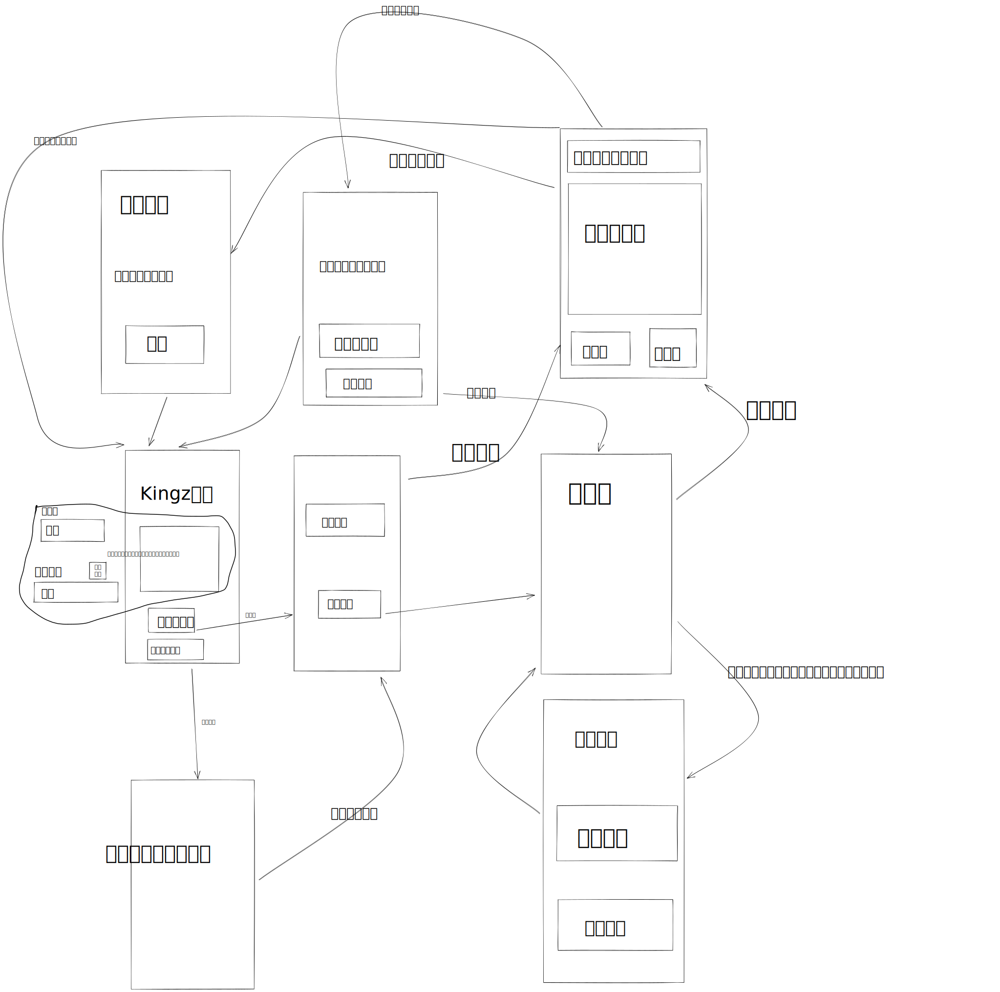

# 云端功能需求

## `GET /saved_games/{玩家ID}`

返回格式如下

```javascript
{
  idx: 存档的id
  match_token: 棋局token，同下面的定义
}
```

## `POST /register`

content-type按照下面的来，只有`nickName`和`secret`两个值。这个content-type就是普通form submit的时候浏览器默认采用的。

`secret`，不能为空，必须是满足regex`[0-9A-Z]{8}`。

`nickName`，不能为空，云端限制一个合理的长度。

示例如下：

```http
POST /register HTTP/1.1
Content-Type: application/x-www-form-urlencoded

nickName=%E6%9D%8E%E7%A7%89%E6%9D%83&secret=9AA342CF


```

要返回一个玩家ID，要求是`p[0-9A-Z]{12}`。

### 异常事件流

如果有某项为空或者没有这个键，就返回400 bad request。

## `POST /match/{玩家ID}`

给这个玩家一个棋局，保证有一个对手，但是还没有棋盘状态。这个棋局可以是全新的棋局，也可以是残局。

返回一个棋局token。

## `GET /match/{棋局token}/opponent`

客户端拿到棋局token后会反复请求这个地址，保证不会太频繁。

返回一个字符串就行，下面三种情况

- 成功(success)
- 失败(fail)
- 等待(waiting)

## `DELETE /match/{玩家ID}/`

这个玩家取消匹配了，解开此玩家ID和此前棋局token的绑定。

## `GET /match/{棋局token}/{玩家ID}`

请求带有一个参数token。
返回的格式

```js
{
    token: 棋局ID,
    data: 下面描述的二维数组
    roundIdx：一个整数
}
```

二维JSON数组中每个元素用一个字符串，格式为`[a-z][n,a,b][0-9]{1,4}`，第一个小写字母表示地块的类型，第二个表示归属，后面的数字表示兵力数量。

兵力数量就是一个整数。

地块类型：

- m (ountain) 障碍物
- e (mpty) 空地
- f (ortress) 堡垒
- h (ome) 基地。

归属：

- n (eutral) 中立
- a 其中一个玩家
- b 另一个玩家

### 异常事件流

`token`不存在就返回404，和空body。

这个玩家不属于这个棋盘就返回404，和空body。

## `PUT /match/{棋局的token}/{玩家ID}`

格式跟上面的返回格式一样，含义也一样。

### 异常事件流

`token`不存在的话就返回404。

`roundIdx`小于或者等于云端的话就抛弃不理会。

## `DELETE /match/{棋局的token}/{玩家ID}`

云端解除这个玩家和这个棋局的关联。

返回空body，200状态码就行。

### 异常事件流

token或者ID没有的话就返回204

# 云端时间进度

这部分由刘某某组织设计，由祁某某和刘某某编码实现，十月十七号要做好。

# 前端功能需求

下面用线框图展示典型交互过程。每个方框就是对应一个用户看到的页面，其中也包含了对该页面上视觉元素的粗略设计，仅供参考。

下图类似UML所讲的状态图，箭头表示在页面之间跳转，箭头上的文字标注表示发生了的行为。初始状态显然是Kingz游戏标题页，最后也会回到这里。要注意的是，这里的箭头并没有被穷尽地列出。



## 前端的设计

我们的前端应该划分为一些【零件】，这些零件用发布和订阅事件来跟其他零件交互。这些零件要向作为全局变量存在的唯一的【事件总线】实体订阅自己感兴趣的事件，并通过这一实体发布事件。

> 笔者按，零件是抽象组件或者模块的意思，不用组件是避免跟各种前端框架里的组件混淆。

例如：*等待中页面*就可以订阅**匹配到了**、**取消匹配**、**匹配失败**等事件，事件发生时这些零件做相应的事情，需要的话可以通过事件总线来发布消息。

为了区分各种消息，每个消息都要有一个`type`字段。

如果要给订阅者提供信息，还需要带上一个的数据块，也就是下面的`payload`字段。

示意如下：

```js
{
  type: 类型
  payload: 数据块
}
```

## 前端事件规约

### 零件：主界面

前置要求：无

### 零件：选择跟电脑玩或者匹配玩家

前置要求：

- 玩家网名

### 零件：匹配中

前置要求：

- 玩家网名，本机指纹，

本页面等待`GameHttpClient`的结果，如果回报失败则显示失败页面，询问玩家是否继续等。

### 零件：棋盘页

前置要求：

- 如果是在线匹配游戏，必须有棋盘token，玩家在线handle

## 前端的实现任务                  

### 编写公共代码

#### 事件总线

这一个实体大致实现下面这个接口，emit就是发布事件的意思，on就是用来订阅某个事件和事件处理函数的。为了调试的方便，要求在控制台记录所有发布出来的事件，以及调用了哪些订阅者。

```typescript
interface {
    emit(event_type: string, payload: any): void;
    on(
        event_type: string,
        subscriber: (ev: {event_type: string, payload: any}) => void
    ): void;
}
```

#### 组件间路由

路由的意思就是在页面之间切换。这一实体侦听一种定义好的路由事件，按照需要更换显示出来的页面。

### 按照云端API封装客户端代码

编写一个【云端请求类】把对这些API的请求写进这个类的各种方法中去，以便各页面中的代码来调用。

#### 设计

下面这些方法都可能发送网络请求，所以都是异步的，如果有没有预料到的http错误，会抛出异常。

##### `OnlineIdentity`

该类负责用户的注册和在线身份的管理，包括有如下方法

- `register(nickname:string):Promise<OnlineHandle>`

  用一个网名来注册，返回一个在线句柄。

- `fetch_local_identity():Promise<OnlineHandle|null>`

  查询本机有没有注册，如果`localStorage`没有就向云端查询，都没有就返回null

##### `KingzHttpClient`

- `构造函数(onlineHandle)`

-  `fetach_my_games():Promise<GameState[]>`

  从云端或者`localStorage`获取`GameState`的列表，供残局对战使用

- `fetch_init_game(matchHandle):Promise<GameState>`

- `try_match():Promise<MatchHandle>`

- `push_local_state(localState):Promise<Promise<GameState>>`

  异步地返回一个Promise，里面有云端的状态

### 编写各个页面的代码

这里说的页面就是上面图中的方框，对每个页面要做这些操作：

0. 考虑要不要把跟它有频繁关系的页面归并在一起，编为一个零件。如果没有那就是一个零件渲染一个页面
1. 罗列出这一个零件需要订阅的事件以及要发布的事件，给出数据块的定义，如果有。
2. 编码实现。

# 开发进度记录

## 第八周

- 正在落实零件间交互的细节设计
- 界面设计和实现全部完成

- 正在编写对局匹配功能
