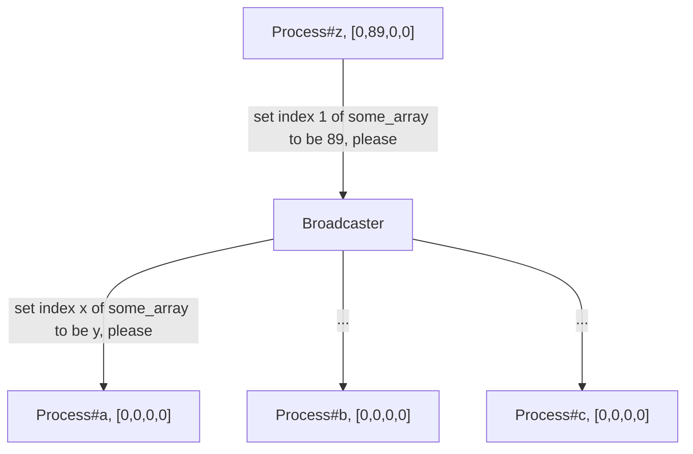

**THIS POST IS WOKR-IN-PROGRESS**

See it live at [live demo](https://li6in9muyou.github.io/software-mutex-sim/)

I built a simple webpage to demonstrate the execution of 4 algorithms that solved the mutex problem. The mutex problem is to ensure that only one of many concurrently running processes is executing the critical region. Being a software solution means that it requires no special hardware or special instructions e.g. test-and-set, compare-and-swap.

The four algorithms I was asked to implement are:

- Lamport's bakery algorithm
- Dekker's
- Peterson's
- Eisenberg & McGuire's

## feature

- Each (simulated) process can be paused and resumed during execution
- Global memory is updated in real-time
- Line number of source code at which the process is executing is updated in real-time

## Implementation Considerations

### concurrent execution

The JavaScript runtime is single-threaded thus to achieve concurrent execution in the browser is not straight forward. This problem is solved by spawning web workers which are mapped to real operating system threads.

Another approach would be to emulate CPU in one thread. This approach requires all four algorithms to be compiled into some sort of "assembly language" so that code can be broken up into pieces. By switching between "contexts", parallel execution can be achieved. 

For example, the following JavaScript code

```javascript
// original JavaScript code
wants_to_enter[this.who] = Dekker.TRUE;
while (Dekker.TRUE === wants_to_enter[this.counterpart(this.who)]) {
    if (turn[0] !== this.who) {
        wants_to_enter[this.who] = Dekker.FALSE;
        while (turn[0] !== this.who) {
            // busy waiting
        }
        wants_to_enter[this.who] = Dekker.TRUE;
    }
}
```

 can be compiled to

```javascript
[
    Store("wants_to_enter", pid, TRUE),
    JumpIfNotEqual("wants_to_enter", pid, TRUE, 7),
    JumpIfEqual("turn", 0, pid, 6),
    Store("wants_to_enter", pid, FALSE),
    Noop(),
    JumpIfNotEqual("turn", 0, pid, 4),
    Store("wants_to_enter", pid, TRUE),
]
```

The above assembly is compiled manually. Dekker's algorithm is the simplest one among them but compiling its code already requires a lot of tedious work. The approach is quickly abandoned.

### busy waits

Busy waits like

```js
while (should_wait(...)) {
    // busy wait
}
```

are exploited extensively in all four algorithms. Due to the nature of mutex problem, the condition that processes wait on is not going to change it's that process's turn to enter critical region. In another words, these busy waits waits a long time. A naïve implementation of busy wait consumes all computing resource of single CPU core which is bad. Things get worse when there are multiple processes contending the same critical region.

This problem is solved by awaiting a promise inside all busy wait loops. Waiting a promise effectively frees up the CPU so that the event loop will be able to pick up other tasks.

```javascript
while (should_wait()) {
    await sleep(1)
}
```

### shared global memory

Data exchange between master thread and worker threads is extremely limited. And worker threads can not directly access memory used by master thread. 

#### the easy way: ShardArrayBuffer

One solution to this problem is to use [SharedArrayBuffer](https://developer.mozilla.org/en-US/docs/Web/JavaScript/Reference/Global_Objects/SharedArrayBuffer). When pass such objects to multiple workers, they can access the same underlying `ArrayBuffer` hence any updates to that `SharedArrayBuffer` is visible to all worker threads. However, to enable SharedArrayBuffer HTML document needs to be in a secure context. This "secure context" thing, in my scenario, boils down to setting two header entries at the server side. At first, I promptly set this up and call it a day. But later I realize that my page will be served on GitHub Pages where I can not set the response header entries. So I devised another approach.

#### the hairy way: broadcast writes

I think this approach has a name in the field of distributed programming but I have not identified it yet. Another approach would be manually syncing all memory writes. Every process sends its write requests to a centralized broadcaster. Upon receiving any write requests, the broadcaster broadcasts this request to all the other processes. When receiving write requests from other processes, process updates its local copy of global memory. 



Inevitably, local copies of individual processes will be stale from time to time but that's ok because these 4 algorithms are all designed to work under such conditions. In fact, there is no ground truth for a global memory with this approach. Should there be any communication issues, i.e. packet lose, processes will never agree with each other any more. Furthermore, this approach is not easily scalable with numerous messages being passed around. Despite these shortcomings, it's good enough for this particular application.

In practice, all processes subscribe to an observable in master thread and a broadcaster in master thread subscribe to all processes.

And in simulated process's code, we update local copy on every write

```javascript
update(ev) {
   const [slice, index, arr] = ev;
   local_copy[slice][index] = arr;
}
```

