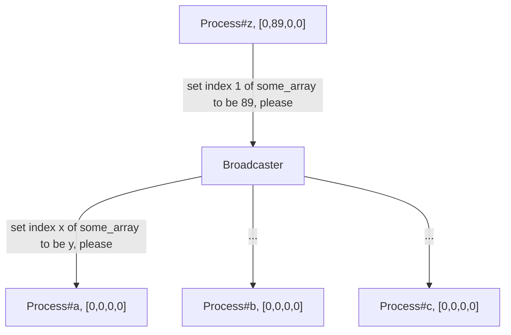

**THIS POST IS WOKR-IN-PROGRESS**

See it live at [live demo](https://li6in9muyou.github.io/software-mutex-sim/)

I built a simple app to demonstrate the execution of 4 algorithms that solved the mutex problem. The mutex problem is to ensure that only one of many concurrently running processes is executing the critical region. Being a software solution means that it requires no special hardware or special instructions e.g. test-and-set, compare-and-swap.

The four algorithms I was asked to implement are:

- Lamport's bakery algorithm
- Dekker's
- Peterson's
- Eisenberg & McGuire's

## Features

- Each (simulated) process can be paused and resumed during execution
- Global memory is updated in real-time
- Line number of source code at which the process is executing is updated in real-time

## Background

This app simulates a scenario where many processes are contending a lock. These algorithms implements `lock()` and `unlock()` routines for such a lock. All four algorithms uses some shared memory, e.g. `wants_to_enter` and `turn` in the following snippet.

```javascript
async function lock(...) {
  wants_to_enter[pid] = TRUE;
  while (TRUE === wants_to_enter[counterpart(pid)]) {
    if (turn[0] !== pid) {
        ...
    }
  }
}
```

By definition, shared memory means that all processes are able to observe modifications made by other processes. Typically, `lock()` routine of these algorithms only writes to a same memory index, e.g. `pid`, and occasionally iterates over all elements in memory.

## Implementation Considerations

### concurrent execution

The JavaScript runtime is single-threaded thus to achieve concurrent execution in the browser is not straight forward. This problem is solved by spawning web workers which are mapped to real operating system threads.

Another approach would be to emulate CPU in one thread. This approach requires all four algorithms to be compiled into some sort of "assembly language" so that code can be broken up into pieces. By switching between "contexts", parallel execution can be achieved.

For example, the following JavaScript code

```javascript
// original JavaScript code
wants_to_enter[this.who] = Dekker.TRUE;
while (Dekker.TRUE === wants_to_enter[this.counterpart(this.who)]) {
  if (turn[0] !== this.who) {
    wants_to_enter[this.who] = Dekker.FALSE;
    while (turn[0] !== this.who) {
      // busy waiting
    }
    wants_to_enter[this.who] = Dekker.TRUE;
  }
}
```

can be compiled to

```javascript
[
  Store("wants_to_enter", pid, TRUE),
  JumpIfNotEqual("wants_to_enter", pid, TRUE, 7),
  JumpIfEqual("turn", 0, pid, 6),
  Store("wants_to_enter", pid, FALSE),
  Noop(),
  JumpIfNotEqual("turn", 0, pid, 4),
  Store("wants_to_enter", pid, TRUE),
];
```

The above assembly is compiled manually. Dekker's algorithm is the simplest one among them but compiling its code already requires a lot of tedious work. The approach is quickly abandoned.

### busy waits

Busy waits like

```js
while (should_wait(...)) {
    // busy wait
}
```

are exploited extensively in all four algorithms. Due to the nature of mutex problem, the condition that processes wait on is not going to change it's that process's turn to enter critical region. In another words, these busy waits waits a long time. A naïve implementation of busy wait consumes all computing resource of single CPU core which is bad. Things get worse when there are multiple processes contending the same critical region.

This problem is solved by awaiting a promise inside all busy wait loops. Waiting a promise effectively frees up the CPU so that the event loop will be able to pick up other tasks.

```javascript
while (should_wait()) {
  await sleep(1);
}
```

### observe and command processes

#### tracing hooks

In order to report one process's progress to UI sub-system, we can have them emit tracing events when executing. To do that, tracing function calls must be added in the algorithm implementation. The following example is the `lock()` routine of the Peterson's algorithm. `break_point(...)` is tracing call which is named breakpoint because this call can pause function execution as well.

```javascript
async function lock(...) {
  ...
  for (let i = 1; i < victim.length; i++) {
    await break_point(1);
    await break_point(2);
    level[pid] = i;
    await break_point(3);
    victim[i] = pid;
    await break_point(4);
    do {
      await break_point(100);
      await Yield();
      ...
    } while (!can_proceed(pid, i, level, victim));

    await break_point(5);
    await Yield();
  }
  ...
}
```

In side `break_point` function call, it emits a `LineNumber` event.

```javascript
const LineNumber = (lineno: number) => ({
  type: "lineno",
  payload: lineno,
});
const Pre = () => ({ type: "pre" });
const Post = () => ({ type: "post" });
const Running = () => ({ type: "running" });
```

Similarly, processes emit tracing events before and after critical region.

```javascript
async (...) => {
	...
    emit(Running())
    await lock_impl(...);

    emit(Pre());
    await critical_region();
    emit(Post());

    await unlock_impl(...);
    emit(Completed());
}
```

#### pause a process

Pausing a process can be implemented as blocking at a function call or enter an idle loop. Utilizing the await semantics in JavaScript, I designed the following implementation to pause a running async function.

The execution of a `lock()` routine is paused when it awaits on a promise that is controlled by master thread. This promise is created when a pause request is received and is fulfilled when a resume request is received. `lock()` routine of Lamport's algorithm is shown below.

```javascript
async function lock(...) {
  ...
  flag[pid] = TRUE;
  await break_point(1);
  label[pid] = max(label) + 1;
  ...
}
```

Statements for setting two elements is separated by an await statement where it's going to waiting on the `_pause` promise inside call to `break_point()`. `request_resume()` and `request_resume()` is typically called from master thread.

```javascript
request_resume() {
    shouldPause = true;
    _pause = new Promise((resolve) => {
        _resolve = () => {
            shouldPause = false;
            return resolve(null);
        };
    });
}
```

Pausing flag `shouldPause` along with `_pause` is set or cleared when a pause request is received. Naturally, `_resolve` is called when a resume request is received.

```javascript
request_resume() {
    if (shouldPause && !isUndefined(_resolve)) {
        dbg(`resume ${_i}`);
        return _resolve(null);
    }
    dbg(`this process is not paused`);
}
```

### shared global memory

Data exchange between master thread and worker threads is extremely limited. And worker threads can not directly access memory used by master thread.

#### the easy way: ShardArrayBuffer

One solution to this problem is to use [SharedArrayBuffer](https://developer.mozilla.org/en-US/docs/Web/JavaScript/Reference/Global_Objects/SharedArrayBuffer). When pass such objects to multiple workers, they can access the same underlying `ArrayBuffer` hence any updates to that `SharedArrayBuffer` is visible to all worker threads. However, to enable SharedArrayBuffer HTML document needs to be in a secure context. This "secure context" thing, in my scenario, boils down to setting two header entries at the server side. At first, I promptly set this up and call it a day. But later I realize that my page will be served on GitHub Pages where I can not set the response header entries. So I devised another approach.

#### the hairy way: broadcast writes

Another approach would be manually syncing all memory writes. Every process sends its write requests to a centralized broadcaster. Upon receiving any write requests, the broadcaster broadcasts this request to all the other processes. When receiving write requests from other processes, process updates its local copy of global memory.

This approach eliminates the need for special headers and it can be employed in simple static web pages. I think this approach has a name in the field of distributed programming but I have not identified it yet.



Inevitably, local copies of individual processes will be stale from time to time but that's ok because these 4 algorithms are all designed to work under such conditions. In fact, there is no ground truth for a global memory with this approach. Should there be any communication issues, i.e. packet lose, processes will never agree with each other any more. Furthermore, this approach is not easily scalable with numerous messages being passed around. Despite these shortcomings, it's good enough for this particular application.

In practice, all processes subscribe to an observable in master thread and a broadcaster in master thread subscribe to all processes.

In master thread

```javascript
process.source.subscribe((args) => {
  if (isWriteRequest(args)) {
    this.processes.map((process) => process.update(args));
  }
});
```

And in simulated process's code, we update local copy on every write

```javascript
update(ev) {
   const [slice, index, arr] = ev;
   local_copy[slice][index] = arr;
}
```

## General Design

### IProcess and IProcessGroup

Simulated process is modeled by two interfaces as follows:

```typescript
interface IProcessQuery {
  pid: number;
  execution_state: Observable<ProcessLifeCycle>;
  program: IProgram;
}

interface IProgram {
  locking_state: Observable<LockingState>;
  line_number: Observable<number>;
}

interface IProcessCommand {
  start(): Promise<void>;
  resume(): Promise<void>;
  pause(): Promise<void>;
  kill(): Promise<void>;
  set_breakpoint(to_be: boolean): Promise<void>;
}
```

Shared memory is attached to a group of contending processes. Furthermore to facilitate use cases where all processes are commanded or queried together.

Finally, a process group is modeled as:

```typescript
interface IProcessGroupQuery {
  execution_state: Observable<ProcessLifeCycle>[];
  program: IProgram[];
  memory: Map<string, Observable<Array<number>>>;
}

interface IProcessGroup {
  all: IProcessGroupQuery & IProcessCommand;
  pid(pid: number): IProcess;
  process_count: number;
}
```

Note that type `Observable` used above is nothing more than an interface with a simple `subscribe(subscriber)` method. It's a rather generic and universal concept so I suppose it's ok to put it in interfaces without limiting implementation at any way.

In `IProcessGroupQuery`, memory is modeled as a `Map<string, ...>` where its keys are names of shared objects used in algorithm implementations. UI sub-systems consumes this interface by subscribing to every item in this `Map` object and updates when events are emitted.
