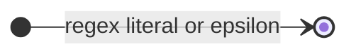
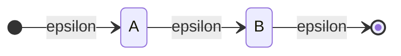
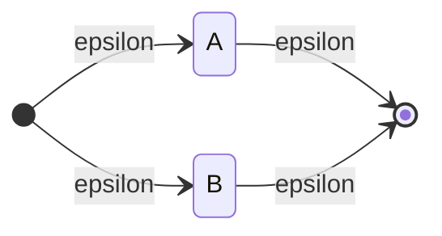

**THIS POST IS WORK-IN-PROGRESS**

I am using this book _"Writing An Interpreter In Go"_ by Thorsten Ball.
You can but this book at [https://interpreterbook.com/]().
In the meantime, I am taking [this free course](https://learning.edx.org/course/course-v1:StanfordOnline+SOE.YCSCS1+3T2020/home)
at edx.org.

# Test Driven Development

This book advocates a TDD approach. Some tests could be tedious to write, so I copy them from the book.
And I wrote tests to reproduce bugs and verify implementation details.
`testing` package provides very limited functionality. You have to write your assertions explicitly, like

```go
peek, _ := lex.peekChar()
if peek != "=" {
  t.Fatalf("expected=%q, got=%q", "=", peek)
}
```

It would be nice to have

```js
expect(peek).toEqual("=");
```

I will find a library to do that for me.

# Lexer

Lexer and parser have a very common behavior. Both of them will peek one character/token then decide which concrete lexer/tokenizer to use. Some tokens may start with the same character. For example, `let` and `latitude` both starts with character `l` but they are keyword and identifier respectively. So when character `l` is encountered a lexer would try to use a sequence of "sub-lexers" according to some predefined priority. When one "sub-lexer" fails, it tries the next one. An example is given below.

```go
word := lexer.eatWord()

t, err = lexer.tryKeyword(word)
if err == nil {
    return t, err
}

t, err = lexer.tryIdentifier(word)
if err == nil {
    return t, err
}
```

# Parser

A parser parses tokens into abstract syntax trees. Parsing is one of the most well-understood branches of computer science and really smart people have already invested a lot of time into the problems of parsing.

I will implement a "Pratt parser" or "top down operator precedence parser"

## from regex to NFA

### simple ones

For regex literal or epsilon moves



For `AB`



For `A + B`



Let's try implementing
[C# spec for real literals](https://learn.microsoft.com/en-us/dotnet/csharp/language-reference/language-specification/lexical-structure#6454-real-literals)

```
Real_Literal
    : Decimal_Digit Decorated_Decimal_Digit* '.'
      Decimal_Digit Decorated_Decimal_Digit* Exponent_Part? Real_Type_Suffix?
    | '.' Decimal_Digit Decorated_Decimal_Digit* Exponent_Part? Real_Type_Suffix?
    | Decimal_Digit Decorated_Decimal_Digit* Exponent_Part Real_Type_Suffix?
    | Decimal_Digit Decorated_Decimal_Digit* Real_Type_Suffix
    ;

fragment Exponent_Part
    : ('e' | 'E') Sign? Decimal_Digit Decorated_Decimal_Digit*
    ;

fragment Sign
    : '+' | '-'
    ;

fragment Real_Type_Suffix
    : 'F' | 'f' | 'D' | 'd' | 'M' | 'm'
    ;
```

## error handling

Error occurs when current token is different from what the parser expects. For now, this parser
simply adds descriptions of such mismatch to an array.

## parse let statement and return statement

### let statement

1. ensure there is a LET token
2. try parse an identifier
3. ensure there is an equal sign
4. try parse an expression

```go
func (parser *Parser) tryLetStatement() (ast.LetStatement, error) {
	var err error
	stmt := ast.LetStatement{}

	stmt.Token = parser.currentToken
	parser.eatToken()

	stmt.Name, err = parser.tryIdentExpr()
	if err != nil {
		return stmt, err
	}
	parser.eatToken()

	err = parser.tryAssignOp()
	if err != nil {
		return stmt, err
	}
	parser.eatToken()

	// parse an expression, not implemented yet.

	return stmt, nil
}
```

Steps above closely resemble a let statement literal.

### return statement

1. ensure theres is a RETURN token
2. try parse an expression

```go
func (parser *Parser) tryReturnStatement() (ast.ReturnStatement, error) {
	stmt := ast.ReturnStatement{}

	stmt.Token = parser.currentToken
	parser.eatToken()

	// parse an expression, not implemented yet.

	return stmt, nil
}
```

### identifier expression

To parse this expression, simply eat one Token.
Its value is that token's literal.

### integer literal expression

To parse this expression, simply eat one Token.
Then call `strconv.Atoi` to get its numerical value.

```go
type IntegerLiteral struct {
	Token token.Token
	Value int
}
```
