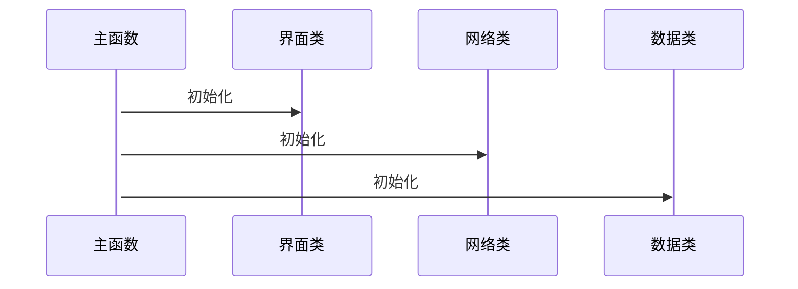
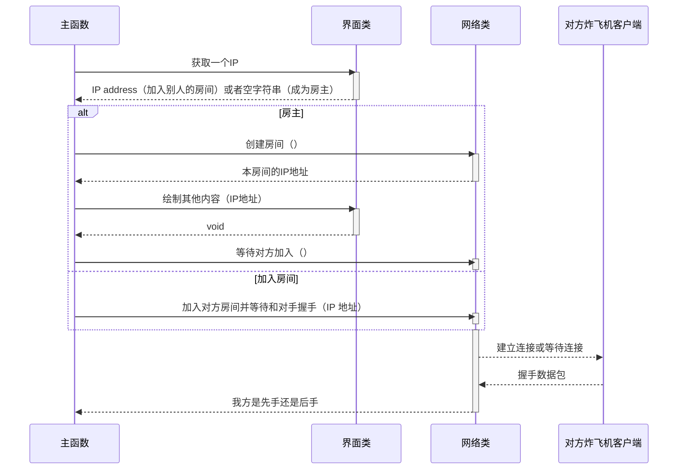
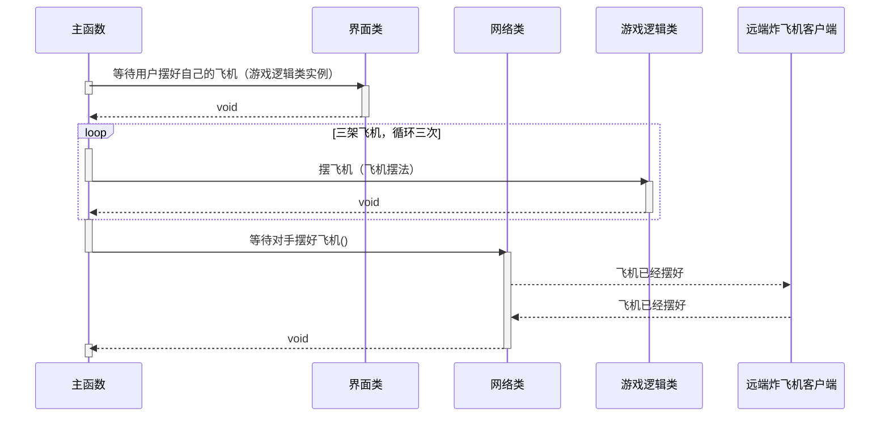
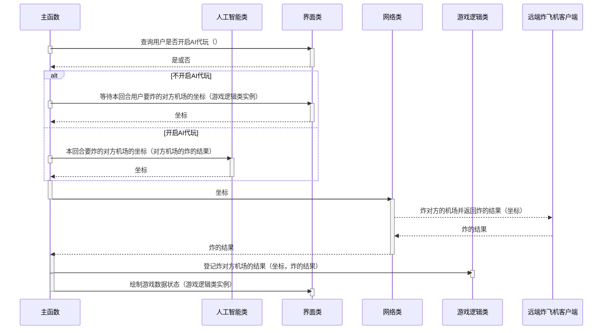
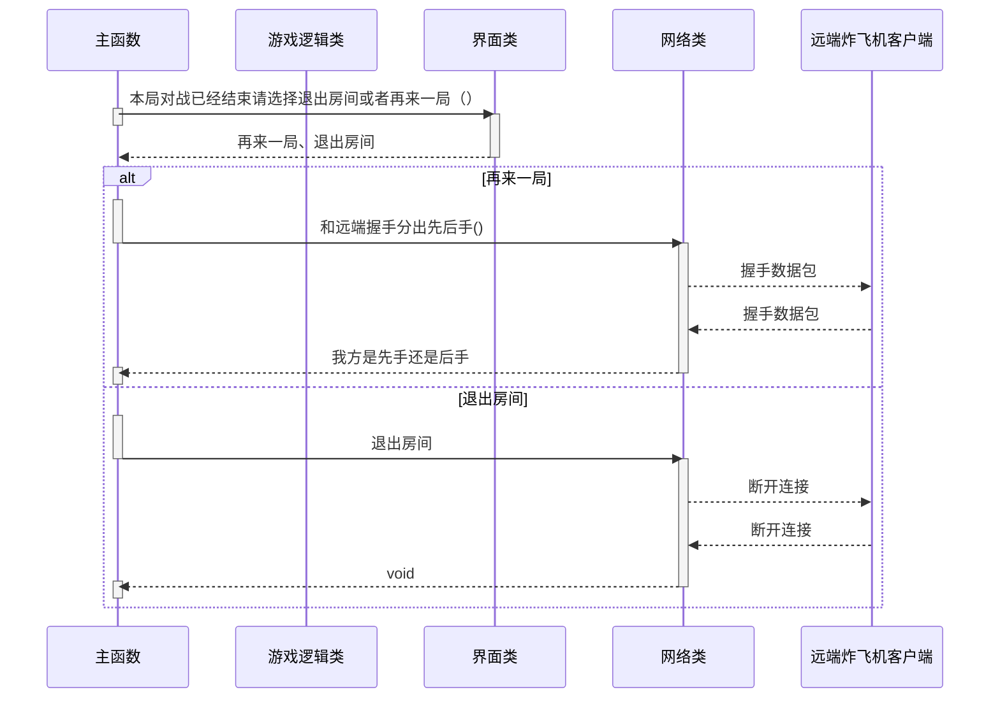

小队成员中都不太熟悉 dotnet 语言生态也不熟悉基于 git 的合作开发模式，我负责系统的整体设计和部分子系统的开发，
我给出了系统各模块的接口设计，并跟小队成员分享了 git 和 GitHub 的常见使用方法，最终小队各成员都熟悉了 git 的常用操作并
在时间期限前完成了开发任务。

> 本文是设计文档，该开发过程的反思
> 在[此链接]()。

# 炸飞机

# 炸飞机游戏逻辑类

本类负责实现游戏逻辑，并提供当前的游戏状态给需要查询的其他模块，游戏状态表示如下。

- 飞机摆法列表：一个列表，里面各元素记录有机头坐标和飞机朝向。
- 系统猜想的敌方飞机的摆法：一个列表，里面各元素记录有机头坐标和飞机朝向。
- 本方机场挨炸：一个列表，装有挨炸位置的坐标。
- 我方炸对方机场得到的结果：一个列表，里面各元素记录有坐标和炸的结果。

修改上述的游戏状态是不会改变游戏逻辑类内部的游戏状态的。

## 设计思路

游戏中有两个机场，一个摆有自己飞机的机场，另一个用来记录炸对手机场的结果。
对手机场上飞机的摆法本方客户端是不可见的。
数据类包括：
存有 3 个飞机头+方向的 AirplanePlace 类（单例）
可实例化的“飞机头+方向”的 Airplane 类（非单例）
本方机场被炸的坐标集，BeBombed、（单例），用 HashSet 存一系列坐标点
敌方机场被炸的坐标集+状态，OpponentAirfield（单例），用什么类型的数据结构还不知道

一些约定：
飞机原点坐标约定为左上角(0,0),x➡ 右增，y⬇ 下增
本方机场图像状态=飞机头坐标+方向+被炸的坐标集
（分别在 AirplanePlace 和 BeBombed 类中。需要写算法计算具体状态，已经保证不会越界/重叠）
敌方机场状态=坐标+状态（都在 OpponentAirfield 类中）

## 1、摆飞机（坐标，上、下、左、右）：

怎么用?
实例化一个游戏逻辑类对象（GameLogic 类），不断调用其中的方法 setAirplane(int x,int y,String d),
若传入成功，返回 bool 类型的 true，若传入不成功，则可能是（飞机机头/机身坐标越界、重叠），需要提示用户，返回 false
里面的算法逻辑：
1）、机头/机身坐标是否越界
2）、获取已有飞机坐标，判断是否有飞机坐标重叠
返回 bool 值

```c#
public class Coordinate
{
    public int X;
    public int Y;

    public Coordinate(int x, int y);

    public static Coordinate Void();
}
```

## 2、本方机场挨炸（坐标）：返回炸的结果，未炸中、炸中了机身、炸中了机头。

炸的结果使用 C# 枚举类。

```c#
public enum BombResult
{
    Miss,
    Hit,
    Destroyed
}
```

## 3、登记炸对方机场的结果（坐标，炸的结果）：炸的结果同上条。

将敌方返回的结果登记在代表敌方机场的数据结构中

## 4、我的飞机全部被摧毁了吗（）：返回是或否。

调用此函数，若返回 ture，则说明此场比赛本方输，敌方获胜，若 ture，则向敌方发送"认输"包
此外，此函数必须在 2、本方挨炸方法 的调用之后使用

## 5、导出当前游戏状态（）：供读者读取游戏状态，具体表示见上文。

导出的结果是一个 GameStateSnapShot，里面有敌方机场坐标+状态，我方机场飞机坐标+方向，我方机场被炸的坐标+状态

## 实现细节设计

使用单例模式来保证只有一个实例。

# 网络模块

## 炸飞机协议

炸飞机协议的语法以 EBNF 描述如下，协议语义按照上边非终端符号的英文名字的意思来理解就可以了。协议时序定义见下文顺序图的描述。

```text
game = handshake, player ready, [{message}], game over;
message
  = coordinate
  | bomb result
  ;
bomb result = "miss" | "hit" | "destroy";
handshake = digit, digit;
game over  = "end";
yield = "yield";
continue = "continue";
player ready = "ok";
coordinate = digit, "," , digit;
digit = "0" | "1" | "2" | "3" | "4" | "5" | "6" | "7" | "8" | "9";
```

做一个网络沟通交流类，提供一个读取数据的接口，供炸飞机协议类使用。

```c#
public interface ICommunicator
{
    bool IsLostConnection();
    string Read();
    string Expect(Regex expected);
    void Write(string message);
    void Start();
    void Stop();
}
```

## 炸飞机协议类

这个协议类规定了两个炸飞机游戏客户端之间的互动。

- 通知对手我已经摆好飞机（）
- 等待对手摆好飞机（）
  - 阻塞，直到远端客户端发来飞机已经摆好的信息。可能会等很久，对手要摆完他的飞机。
- 炸对方的机场并返回炸的结果（坐标）：炸的结果
- 等待对方来炸我方机场（）：坐标
- 发回我方机场挨炸的结果（炸的结果）
- 等待通知对手我方没有输（）
- 等待向对方认输（）
- 等待对方认输（）：如果对方不认输，返回假，否则返回真

## 基于 TCP 流的网络类

有如下 TCP 特有的方法：

- 创建房间（）：IP 地址
- 加入对方房间并等待和对手握手（IP 地址）：我方是否先手
  - 这个方法抛出异常` CanNotJoin` 如果没办法加入的话。
- 等待对手加入（）：我方是否先手

## 等待类操作的异常事件处理方法

### 网络超时

### 对方玩家操作超时

# 交互界面模块

## 绘制本地玩家败北（）

## 绘制本地玩家胜利（）

## 等待用户决定是否在本房间中继续下一局（）：是或否

用户选择否的话整个程序退出。
选择是的话，稍后游戏主程序将调用交互界面模块里面的`等待用户摆好自己的飞机`方法。

## 绘制其他内容（其他内容）

- 聊天信息
- 开发调试信息
- 通知消息
  - 对手的 IP 地址是……、对手已加入房间
  - 对手正在摆飞机
  - 对手正在选定要炸的位置
  - 对手已经离线

## 绘制游戏数据状态（游戏逻辑类实例）

## 等待本回合用户要炸的对方机场的坐标（游戏逻辑类实例）：坐标

阻塞，最多等待 30 秒，从进入这个方法开始计时，如果用户没有输入就返回 `(-1,-1)`。
本方法接受一个游戏逻辑类实例的目的是为了避免用户重复炸已经炸过的地方。

## 等待用户摆好自己的飞机（游戏逻辑类实例）

阻塞。传入一个游戏逻辑类，用来判断用户的摆法是不是合理，交互界面类应该调用摆飞机（……）方法，直到摆好三架。
之前的方案是规定交互界面类不能直接修改游戏逻辑类，在之前的方案中，此方法仅仅是获取飞机摆法而不实际摆飞机，但有可能摆了第一架
飞机之后，返回的列表中的后面两架飞机的摆法会违反规则。

## 等待获取一个 IP 地址（建议的值）：IP 地址

阻塞，如果用户希望创建房间的话就返回空字符串。传入一个建议的值可以实现记忆上次对战的玩家的功能。

# 人工智能模块

## 本回合要炸的对方机场的坐标（游戏逻辑类实例）：坐标

## 推断对方飞机的摆法（游戏逻辑类实例）：飞机摆法列表

返回值定义见上文。

# 游戏流程

## 整个程序流程

```text
各子系统初始化
询问玩家如何联机
两个客户端握手并分出先后手
while ( true ) {
  游戏主循环
  通知对手游戏结果
  通知用户本轮游戏的结果
  如果用户选择退出
    两个客户端关闭连接
    跳出循环
}
系统退出
```

## 游戏主循环

```text
自己玩家摆飞机
通知对方自己已经摆好并等待对方玩家摆好
while ( !本地玩家输了 ）{
  通知对方我方没有输并等待回应
  如果对方回应他输了，跳出循环

  如果是本方回合
    等待UI传回本方玩家要炸的坐标
    传给远端并等待回应
    更新游戏状态
  否则
    等待远端发来坐标
    查询炸的结果
    返回炸的结果

  切换到另一个玩家的回合
}
```

## 游戏各子系统初始化



## 在线游戏功能初始化



## 游戏准备阶段



## 炸飞机阶段

本游戏规定两个玩家轮流丢炸弹。到自己的回合可以丢一个炸弹，丢完一个炸弹后变为对方回合。
回合由主函数协调，一开始是根据网络模块握手的结果给定谁丢炸弹，此后每当收到对方机场挨炸的结果就切换一次
回合。

### 我方等待对手来炸，对手的回合。


### 我炸对方机场，我的回合。



## 游戏胜负已分


