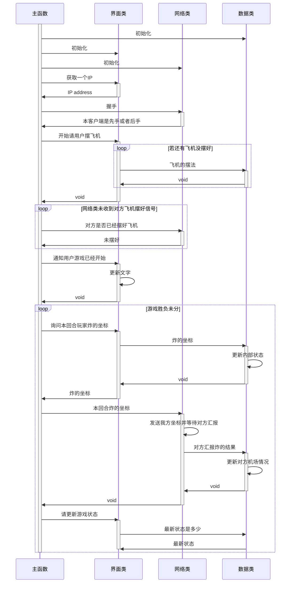

# 游戏顺序图

```mermaid
sequenceDiagram

participant main as 主函数
participant ui as 界面类
participant socket as 网络类
participant game as 数据类

activate main
main ->> game : 初始化
main ->> ui : 初始化
main ->> socket : 初始化

main ->> ui: 获取一个IP
activate ui
ui ->> main: IP address
deactivate ui

main ->> socket: 握手
activate socket
socket ->> main: 本客户端是先手或者后手
deactivate socket

main ->> ui: 开始请用户摆飞机
activate ui
loop 若还有飞机没摆好
ui->>game: 飞机的摆法
activate game
game->>ui: void
end
deactivate game
ui->>main: void
deactivate ui

loop 网络类未收到对方飞机摆好信号
main ->> socket: 对方是否已经摆好飞机
activate socket
socket ->> main: 未摆好
deactivate socket
end

main ->> ui: 通知用户游戏已经开始
activate ui
ui->>ui: 更新文字
ui->>main: void
deactivate ui

loop 游戏胜负未分
main ->> ui: 询问本回合玩家炸的坐标

activate ui
ui->>game: 炸的坐标
activate game
game->>game: 更新内部状态
game->>ui: void
deactivate game
ui ->> main: 炸的坐标
deactivate ui


main ->> socket: 本回合炸的坐标
activate socket
socket->>socket: 发送我方坐标并等待对方汇报
socket ->> game: 对方汇报炸的结果
activate game
game->>game: 更新对方机场情况
game->>socket: void
deactivate game
socket->>main: void
deactivate socket


main ->> ui: 请更新游戏状态
activate ui
ui ->> game: 最新状态是多少
game ->> ui: 最新状态
deactivate ui
end

deactivate main
```
