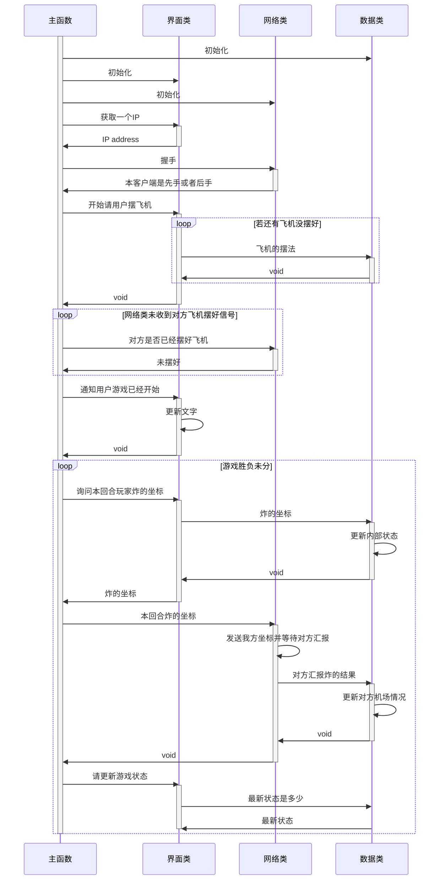

# 类设计

## 炸飞机游戏数据类

游戏中有两个机场，一个摆有自己飞机的机场，另一个用来记录炸对手机场的结果。
对手机场上飞机的摆法本方客户端是不可见的。

- 摆飞机（坐标，上、下、左、右）：
- 本方机场挨炸（坐标）：返回炸的结果，未炸中、炸中了机身、炸中了机头。
- 登记炸对方机场的结果（坐标，炸的结果）：炸的结果同上条。
- 游戏结束了吗（）：如果有一方被炸中机头的次数等于摆有的飞机数则这一方输，另一方赢，游戏结束。
- 现在的状态（）：供读者读取游戏状态，具体表示见下文。

游戏状态的表示

- 飞机摆法：一个列表，里面各元素记录有机头坐标和飞机朝向。
- 本方机场挨炸：一个列表，装有挨炸位置的坐标。
- 我方炸对方机场得到的结果：一个列表，里面各元素记录有坐标和炸的结果。

## 网络类

- 握手（IP 地址和端口号）：跟这个端口上的进程握手。
- 请更新游戏数据类（游戏数据类实例）：修改这个游戏数据类实例
- 读取游戏数据类并发送给远端的炸飞机客户端（游戏数据类实例）：不要在此方法中修改游戏数据类实例
- 是否收到了远端发来的数据要处理（）：如题，返回一个布尔值，不能阻塞很长时间，小于 16 毫秒

此类会在程序入口之后很快被实例化，握手之后应该保存自己的状态，最好不要关闭 TCP 连接。

## 交互界面类

- 请读取游戏状态（游戏数据类实例）：渲染游戏状态
- 请更新游戏状态（游戏数据类实例）：修改游戏状态
- 是否有用户的操作需要处理（）：如题，返回一个布尔值，不能阻塞很长时间，小于 16 毫秒
- 获取一个ＩＰ地址和端口号：由用户输入一个远端炸飞机客户端的ＩＰ地址和端口号

# 游戏顺序图

