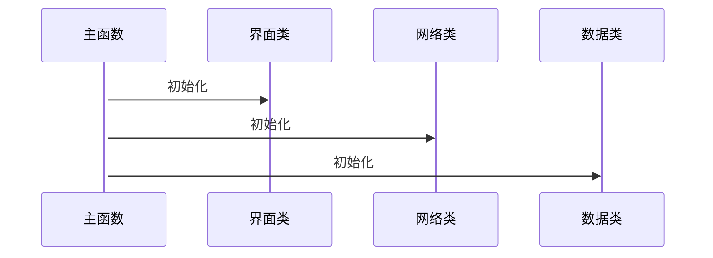
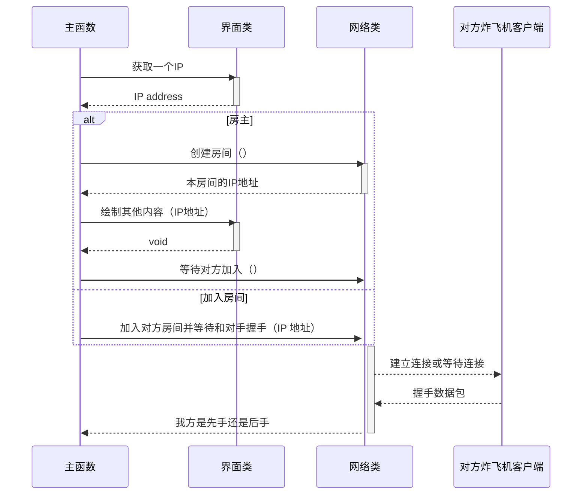
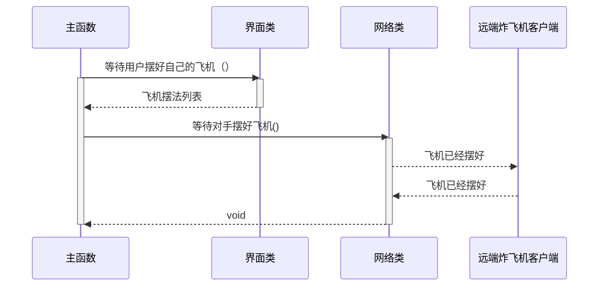
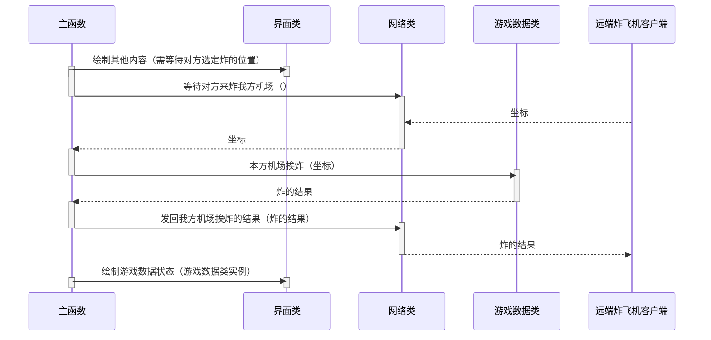
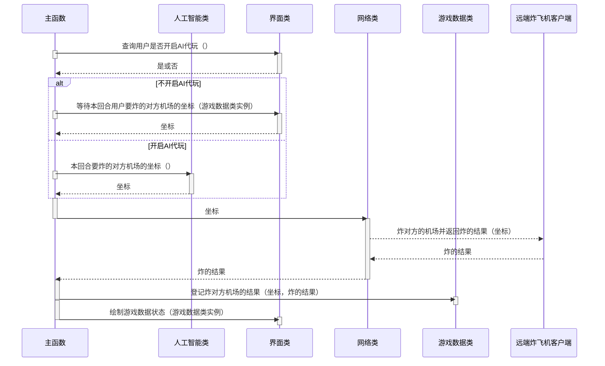

# 炸飞机游戏数据类

游戏中有两个机场，一个摆有自己飞机的机场，另一个用来记录炸对手机场的结果。
对手机场上飞机的摆法本方客户端是不可见的。

## 摆飞机（坐标，上、下、左、右）：

## 本方机场挨炸（坐标）：返回炸的结果，未炸中、炸中了机身、炸中了机头。

炸的结果使用 C# 枚举类。

```c#
enum BombResult
{
    Hit = "炸中了",
    Destroyed = "摧毁了",
    Miss = "空了",
}
```

## 登记炸对方机场的结果（坐标，炸的结果）：炸的结果同上条。

## 游戏结束了吗（）：如果有一方被炸中机头的次数等于摆有的飞机数则这一方输，另一方赢，游戏结束。

## 现在的状态（）：供读者读取游戏状态，具体表示见下文。

## 游戏状态的表示

- 飞机摆法列表：一个列表，里面各元素记录有机头坐标和飞机朝向。
- 系统猜想的敌方飞机的摆法：一个列表，里面各元素记录有机头坐标和飞机朝向。
- 本方机场挨炸：一个列表，装有挨炸位置的坐标。
- 我方炸对方机场得到的结果：一个列表，里面各元素记录有坐标和炸的结果。

## 实现细节设计

使用单例模式来保证只有一个实例。

# 网络模块

## 等待类操作的异常事件处理方法

### 网络超时

### 对方玩家操作超时

## 加入对方房间并等待和对手握手（IP 地址）、创建房间并等待对方加入（）

## 等待对手摆好飞机（）

阻塞，直到远端客户端发来飞机已经摆好的信息。可能会等很久，对手要摆完他的飞机。

## 炸对方的机场并返回炸的结果（坐标）：炸的结果

## 等待对方来炸我方机场（）：坐标

阻塞，等待对方回传。

## 发回我方机场挨炸的结果（炸的结果）

## 是否远端已经断开连接（）：是或否

# 交互界面模块

## 绘制其他内容（其他内容）

- 聊天信息
- 开发调试信息
- 通知消息
  - 对手的 IP 地址是……、对手已加入房间
  - 对手正在摆飞机
  - 对手正在选定要炸的位置
  - 对手已经离线

## 绘制游戏数据状态（游戏数据类实例）

## 等待本回合用户要炸的对方机场的坐标（）：坐标

阻塞，最多等待 30 秒，如果用户没有输入就返回 `(-1,-1)`。

## 等待用户摆好自己的飞机（）：飞机摆法列表

阻塞，返回格式见前述游戏数据类部分。

## 等待获取一个 IP 地址（）：IP 地址

阻塞，如果用户希望创建房间的话就返回空字符串。

# 人工智能模块

## 本回合要炸的对方机场的坐标（游戏数据类实例）:坐标

# 游戏流程

## 游戏各子系统初始化



## 在线游戏功能初始化



## 游戏准备阶段



## 炸飞机阶段

### 我方等待对手来炸



### 我炸对方机场


