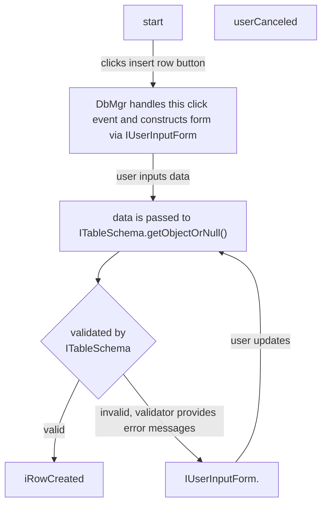

基本思路是模仿 Django ORM 的效果和设计。

# New requirements

New spec requires that user may use the same `JTable` component to input data.
Thankfully, `JTable` component supports cell editing out of the box.
It fires `tableChanged` event on "blur". This event has a rowId and columnId with it and nothing more.
However, this approach does not fit with the current approach where an explicit form.

To implement this feature, a new row with all empty fields
should be added when user decide to insert a row, then new data may be filled in naturally.
Similarly, user may update any attribute of a row directly inside this `JTable` component.

# Interfaces representing one row of data



`ITable` is supposed to be used as a Django `Model`.

```java
interface ITable {
  void createOne(IRow row);

  IRow[] getAll();

  void commitOne(IRow row);

  void deleteOne(IRow row);

  int getRowCount();

  ITableSchema getSchema();
}

interface IRow {
  String getAttribute(String name);

  void setAttribute(String name);

  Map<String, String> listAttributesAsMap();

  void saveChanges();
}
```

`ITableSchema` provides information for `IUserInput` so that it can construct appropriate swing
components.

```java
interface ITableSchema {
  String[] getColumnNames();

  String[] getColumnTypeNames();

  IRow createObjectOrNull(IUserInputForm form);
}
```

# User input form

IUseInputForm constructs `JComponent`s for accepting user input. It may choose different component
for different types.

```java
interface IUserInputFormFactory {
  IUserInputForm createForm(ITableSchema schema);

  IUserInputForm createForm(ITableSchema schema, String[] initialData);
}

interface IUserInputForm {
  JComponent[] getFields();

  String[] getCleanedData();
}
```

Algorithm:

pre-condition:

- DbMgr has an `ITableSchema`

steps:

1. `DbMgr` get an `IuserInputForm` from factory.
2. `DbMgr` get `JComponents[]` from `IUserInputForm`.
3. `DbMgr` renders these components with `JOptionPane.showConfirmDialog()`.
4. if user cancels this operation, exit.
5. `DbMgr` passes `IUserInputForm` to `ITableSchema` trying to get an `IRow`.
6. if got `IRow`, exit.
7. if got null, go to 3.

## reference design in Django

> [Django’s role in forms](https://docs.djangoproject.com/en/4.1/topics/forms/#django-s-role-in-forms)
>
> Django handles three distinct parts of the work involved in forms:
>
> - preparing and restructuring data to make it ready for rendering
> - creating HTML forms for the data
> - receiving and processing submitted forms and data from the client

Similar to tasks listed above, I need to:

- fetching table data from a datasource convert them to string
- creating JComponents to construct an input dialog for user
- validating user input

All data in a row is treated as strings for simplicity.
And I will delegate all validation work to the database. Error messages will be shown to user should error occurs,
then another dialog will prompt them to update data that they entered previously.

Low level interfaces for working with databases:

```java
interface DbBackend {
  IRow createOne(String[] cleanedData);

  IRow[] getAll();

  void commitOne(IRow row);

  void deleteOne(IRow row);
}
```

# 怎么连接到 vmware 虚拟机中的 DB2 数据库？

客户机应该使用 NAT 网络模式，在笔者的这个环境中，不能使用 Bridge 模式，因为没有 IP 会被分配给虚拟机。
此 NAT 模式下，宿主机的一个网卡接口和客户机的一个网卡接口是在同一个子网。

1. 在虚拟机中用`ipconfig`命令查看虚拟机的 ip 地址。
2. 使用此地址和 50000 端口号来连接此数据库。

# 怎么让宿主机中的 java 程序连接到虚拟机中的数据库？

原资料中的连接方法使用的是 DB2 数据库的 type 2 JDBC 驱动，在宿主机上使用 type 4 JDBC 驱动比较方便。
这两中驱动的主要区别是 type 2 驱动依赖于操作系统的原生二进制，type 4 则不需要，因其纯 Java 实现。
这几种驱动的说明见[此链接](https://www.ibm.com/docs/en/db2/9.7?topic=apis-supported-drivers-jdbc-sqlj)。

1. 用你最喜欢的依赖管理器，从 maven 仓库中安装 `com.ibm.db2.jcc:db2jcc:db2jcc4` 库。
2. 在 java 程序中载入 `com.ibm.db2.jcc.DB2Driver` 驱动类。
3. 用`DriverManager.getConnection("jdbc:db2://<ip addr>:50000/sample", "<user name>", "<user password>")`
   得到一个`Connection`类实例。

注意，在源码中写入用户名，用户密码，和数据库主机地址是非常非常恶劣的行为。
比较好的在各编程语言生态中通行的做法是从环境变量中引入这些秘密的值。Java 生态中还有其他的引入秘密的方法。

# 怎么显示详细的出错信息

先尝试在 JDBC 连接字符串中设置 `retrieveMessagesFromServerOnGetMessage` 属性为真，
此后，捕获到JDBC驱动抛出的异常时，使用 `getMessage()` 就可以得到详细的错误说明。

示例如下：

```java
public static class Program {
  private final static Connection con = DriverManager.getConnection(
    "jdbc:db2://192.168.245.128:50000/sample:" +
      "retrieveMessagesFromServerOnGetMessage=true;",
    "student",
    "student"
  );
}
```

如果显示的不是中文，则需使用如下方法，手动查询中文简体字的错误说明。也许可以在数据库后台设置本地化策略集为中文简体以免去
下面描述的步骤。

1. 捕获 JDBC 驱动抛出的异常。
2. 强制将此异常类型转换为 `com.ibm.db2.jcc.DB2Diagnosable`，再调用 `getSqlca()` ，得到一个 `DB2Sqlca` 对象。
3. 作如下查询，查询字符串为 `values (sysproc.SQLERRM(?, ?, ';', 'zh_CN', 1))`，第一参数设置为字符串
   `"SQL%s".formatted(Math.abs(sqlca.getSqlCode()))`，第二参数设置为`sqlca.getSqlErrmc()`

示例如下：

```java
public static class Program {
  private final static Connection con;

  public String fetchErrorMessage(Throwable error) {
    if (error instanceof DB2Diagnosable) {
      DB2Sqlca sqlca = ((DB2Diagnosable) error).getSqlca();
      PreparedStatement query = con.prepareStatement(
        "values (sysproc.SQLERRM(?, ?, ';', 'zh_CN', 1))"
      );
      query.setString(1, "SQL" + Math.abs(sqlca.getSqlCode()));
      query.setString(2, sqlca.getSqlErrmc());
      ResultSet rs = query.executeQuery();
      rs.first();
      return rs.getString(1);
    } else {
      return error.getMessage();
    }
  }
}
```

关于这种做法的详细说明见
[Handling an SQLException under the IBM Data Server Driver for JDBC and SQLJ](https://www.ibm.com/docs/en/db2/9.7?topic=ewudsdjs-handling-sqlexception-under-data-server-driver-jdbc-sqlj)
。
