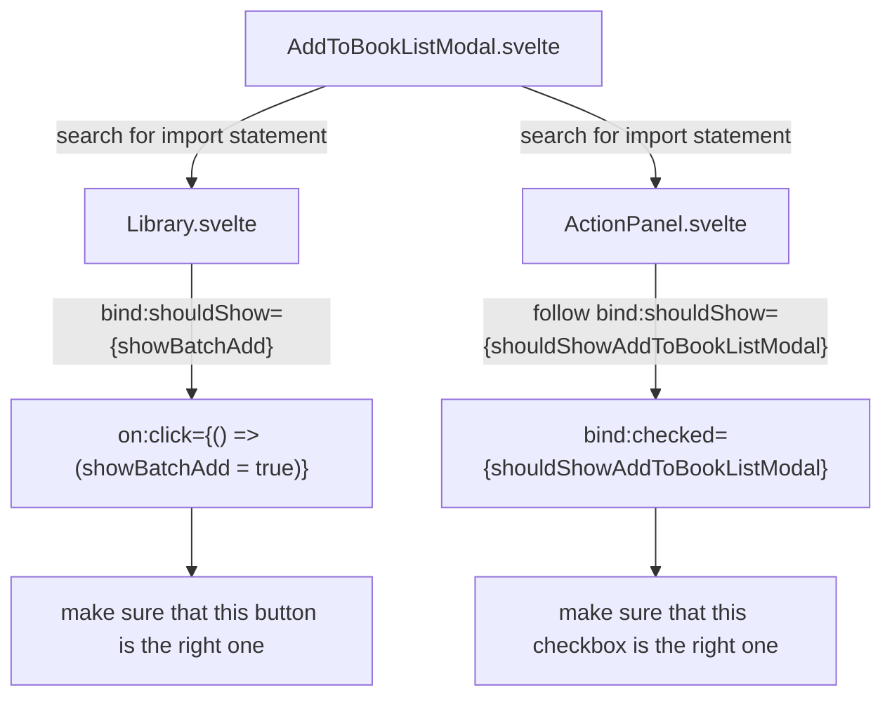

This web app is initially built with svelte without much third party dependencies.
Its features include:

- fetching book list from api
- apply filtering by regex
- select/unselect multiple items in list
- add/remove books to a book list
- create book list
- extensive use of loading spinners
- user login/logout/register
- client-side routing

# System overview before refactoring

## `Library.svelte` component

This component has many child components. It passes many functions down to its children
via `setContext` mechanism provided by Svelte. These functions are used to config the
filtering and to control multi-selection state. For example,
in the [original post]()
I have cataloged the following

A `Filter` object is shared between `Library.svelte` component
and a `Filter.svelte` component. The root component listens for changes to this `Filter`
object and update item listing, `Filter.svelte` updates this object upon user interactions.
Multi-selection helpers i.e. select-all/reverse-selection/clear-selection are implemented in
a similar fashion.

Furthermore, this `Library.svelte` component toggles the `AddToBookListModal.svelte` component
when user choose to add all books in current selection to her book list.
However, this `AddToBookListModal.svelte` should be shown when user choose to
add one single book to her book list.
These two use cases are essential to this simple app, but it's not clear to see that they
are properly implemented because the hierarchy of components obscures the control follow.
Programmer must trace from `AddToBookListModal.svelte` back to its various clients then to
some click event handlers, only then she could conclude that these two use cases are
implemented. The diagram below illustrates this process.

Besides the mental overhead described above, in that example `ActionPanel.svelte` is actually
also a child of `Library.svelte`, which means that when `Library.svelte` is rendered
there is actually two instances of `AddToBookListModal.svelte` in the subtree of
`Library.svelte`.
This will an an issue if the duplicated components possess some resources e.g. access tokens.

# Refactoring proposal

Use redux through redux-toolkit.

# Pocketbase frontend design

## `pocketbase/ui/src/stores`

App wide states, e.g. active collection, are stored here
as well as states of toasts, confirmations and error notifications.

## `pocketbase/ui/src/actions`

There is only one file implementing a simple tooltip.
