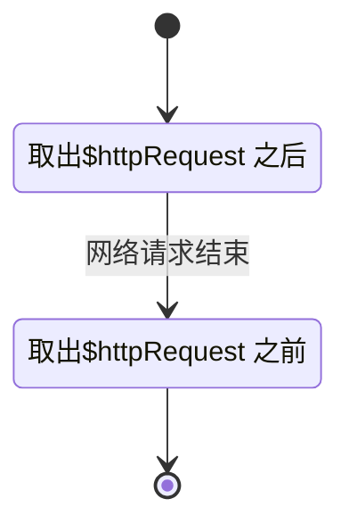

**THIS IS A WORK IN PROGRESS**

# 线程和锁

使用锁元语来完成并发程序的同步和互斥需求，很容易出错，不讨论了。

# 函数式编程

用不可变的状态，其他的跟下面的CSP 几乎一模一样，不讨论了。

# Clojure

都是语言特性，不讨论了

# Actor

actor 是一种由运行时维护的实体，actor 之间可以发送消息，消息是一种不可变的数据类型，被抽象为元组，消息的递送是异步的，有队列作缓存，发送消息不会阻塞，但是接收消息时如果没有消息，就会阻塞。actor 创建时，指定一个消息处理函数，如下面的cache。

跟CSP 也是很像的，靠运行时阻塞住函数执行，状态不变，但其实储存在栈帧。

```elixir
def cache(pages, size) do
  receive do
    {:put, url, page} ->
      new_pages = Dict.put(pages, url, page)
      new_size = size + byte_size(page)
      cache(new_pages, new_size)
    {:get, sender, ref, url} ->
      send(sender, {:ok, ref, pages[url]})
      cache(pages, size)
    {:size, sender, ref} ->
      send(sender, {:ok, ref, size})
      cache(pages, size)
    {:terminate} -> # Terminate request - don't recurse
  end
end
```

receive 是阻塞的直到有别的actor 给他发消息，也可以设定一个超时处理函数。

actor 可以创建别的actor。创建actor 时，可以监听特殊的一个退出事件，并把退出的actor 重新启动。这样的监听退出事件并重启别的actor 的actor 又称为supervisor。这样一来，同时使用supervisor 和actor 可以构建一个树，内部节点为supervisor 叶子节点为actor ，我们可以把业务逻辑分散在数量众多的actor 里面，即使运行时出现异常也能很快恢复。

但是重启的时候怎么恢复到退出时的状态，因人而异，这里不讨论了。

# Communication sequential processes

应用程序的运行时提供一个抽象元语叫做channel ，有放入和取出两种操作，如果之前没人执行放入，取出操作阻塞，如果之前没人执行取出操作，放入操作阻塞。channel 对象作为函数参数或者从函数中返回。跟经典元语信号量有点类似，但是比他更方便；

这样一来，等待IO 、等待用户操作等概念就可以用一种同步的代码来表达。对比如下代码，前一段是使用了回调函数，后一段是使用了channel 的。

```js
fetchData(searchTerm, funciont (result) {
  updateUI(result)
})

const $httpRequest = fetchData(searchTerm)
const result = 取出($httpRequest)
updateUI(result)
```

channel 的实现方法之一是把使用了channel 的函数改写为一个状态机，状态是按照channel 的放入和取出操作来划分，输入自然就是各个channel 的阻塞状态的变化，例如：



函数内的代码则在离开或者进入状态的时候执行，状态机的输入是由channel 的现实的运行时提供的。这种改写可以在编译时，自动生成代码，也可以是在程序运行的时候由运行时调度。

# Data parallelism with GPU

GPU 里面有很多能并行运行的处理器，借助OpenCL、OpenGL 等编程接口，我们可以用他们更快的完成某些计算，不讨论了。

# Lambda architecture

## Batch layer

这一层处理永恒真实并且不可变的数据，这个东西有时候需要稍微修改数据。例如，存储用户的收货地址时需要同时记录时间戳，否则单记录地址的话很容易就变化了。有了永恒真实的不可变数据，并行计算变得容易一些了。在实现上，我们可以使用MapReduce 之类的方法来根据这些不可变数据计算出衍生数据。但是根据这些数据计算出的衍生数据，需要比较长的时间，计算出的数据肯定是滞后，所以必须引入Speed layer 来实时响应需求。

例如，分批计算的数据是按周汇总计算的，我们可以轻易借助这些周汇总数据来计算任意时间段内的数据。

It calculate derived data over some raw data in advance to provide a _batch view_ e.g. `select sum(sales) from daily_sales group by WEEK(date)` runs an aggregation function on weekly data.
Afterwards, the same aggregation function that runs on any time interval can be computed with some pre-computed data.
For example, when aggregating on a period of 10 days, it can find a pre-computed weekly data then merge aggregation results from the rest 3 days thus saving computation.
Note there are two downsides in such batch-and-cache operation.
One is that data records it pre-computed with can not be mutated after creation otherwise all pre-computed results will be invalidated.
Second is that sometimes such batch view computation can take a significant amount of time i.e. batch view always lags behind and out-of-date.

## Speed layer

这个部分只要能应付较短时间内产生的数据就可以了，实现方法是灵活多变的，不讨论了。
